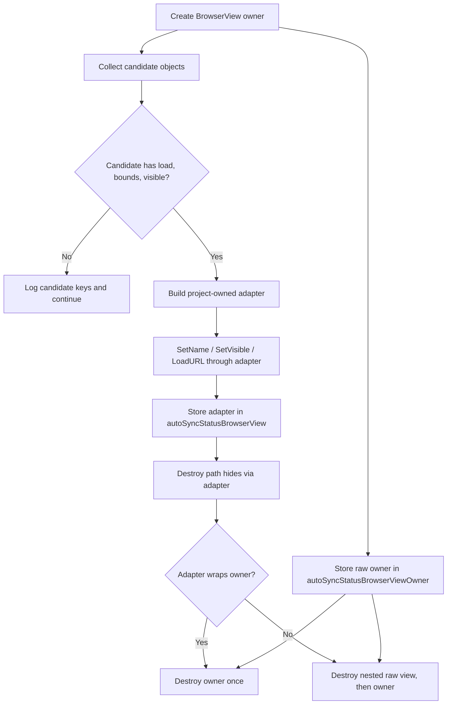

# Replace BrowserView Alias Mutation With a Delegate Adapter

Date: 2026-05-25
Planner Model: codex_gpt-5
Review Source: `docs/review/2026-05-24_gemini_3_5_flash.md`

## Execution Skill

Execute this plan with the `implementer` skill. The implementation must follow that
skill's discovery, branch isolation, strict TDD, atomic commit, validation, and
review-gate workflow, while also honoring this repository's `AGENTS.md` protocol.

## Problem Definition

`src/index.tsx` normalizes Steam BrowserView objects by assigning uppercase method
aliases directly onto native objects:

```typescript
if (!raw.LoadURL && raw.loadURL) raw.LoadURL = raw.loadURL;
```

Steam host-binding objects may be frozen, sealed, proxy-backed, or otherwise
non-extensible. Assigning aliases can throw `TypeError: Cannot add property ...,
object is not extensible`. The current `ensureAutoSyncStatusBrowserView()` catches
that error and disables the status strip, but the plugin should not mutate native
objects just to normalize method names.

The fix should make BrowserView normalization read-only: inspect available methods,
then return a project-owned adapter object that delegates to the raw native object.

## Architecture Overview

Remove `patchBrowserViewMethodAliases()`. Replace it with a normalizer that returns a
small adapter object when the raw candidate exposes the required BrowserView
capabilities under either uppercase or lowercase names.

The adapter owns method normalization only. The native BrowserView or owner object
continues to own the real resource lifecycle. Destruction must preserve explicit
nested BrowserView cleanup while preventing root-owner double-destruction.



## Core Data Structures

No persistent data model changes are required.

Implementation-local helper types:

- method lookup helper for upper/lower-case variants
- adapter object implementing `AutoSyncStatusBrowserView`
- adapter construction input that knows both the raw candidate and the root owner

Recommended policy:

- Expose `Destroy` on the adapter only when the normalized raw candidate is not the
  root owner. This preserves explicit nested BrowserView destruction without calling
  the owner's native destroy method twice.
- Delegate `SetTopmost` because `ensureAutoSyncStatusBrowserView()` currently probes
  and calls it dynamically.
- Add `SetTopmost?: (value: boolean) => void` to `AutoSyncStatusBrowserView` so
  the implementation does not need `(normalized as any).SetTopmost`.

## Public Interfaces

No user-facing API changes.

Type-level change:

- `AutoSyncStatusBrowserView` can remain as the normalized uppercase method shape.
- Add optional `SetTopmost?: (value: boolean) => void`.
- `AutoSyncStatusBrowserViewOwner` can remain the permissive shape for nested owner
  candidates.

## Implementation Steps

1. Delete `patchBrowserViewMethodAliases()`.
2. Add helper functions for safe method lookup.
3. Update `normalizeAutoSyncStatusBrowserView()` to:
   - iterate the existing candidate list
   - avoid all property assignment on candidates
   - require load, bounds, and visible methods
   - return a new adapter object
   - pass both the candidate and the root owner into adapter construction
4. Ensure adapter method calls bind `this` to the raw native object with
   `fn.call(raw, ...)` or `.bind(raw)`.
5. Implement adapter `Destroy` conditionally:
   - `undefined` when `raw === owner`
   - delegated raw destroy method when `raw !== owner`
6. Add `SetTopmost` delegation and update the type definition.
7. Keep `destroyAutoSyncStatusBrowserView()` compatible with existing static
   assertions while preventing root-owner double-destruction through conditional
   adapter `Destroy`.
8. Preserve existing diagnostic logging for missing candidates.

## Example Code

```typescript
function browserViewMethod<T extends (...args: any[]) => void>(
  raw: any,
  upperName: string,
  lowerName: string,
): T | null {
  const method = raw[upperName] ?? raw[lowerName];
  return typeof method === "function" ? method.bind(raw) : null;
}

function buildBrowserViewAdapter(
  raw: any,
  owner: AutoSyncStatusBrowserViewOwner,
): AutoSyncStatusBrowserView | null {
  const loadURL = browserViewMethod<(url: string) => void>(raw, "LoadURL", "loadURL");
  const setBounds = browserViewMethod<(x: number, y: number, w: number, h: number) => void>(
    raw,
    "SetBounds",
    "setBounds",
  );
  const setVisible = browserViewMethod<(visible: boolean) => void>(
    raw,
    "SetVisible",
    "setVisible",
  );

  if (!loadURL || !setBounds || !setVisible) {
    return null;
  }

  return {
    LoadURL: loadURL,
    SetBounds: setBounds,
    SetVisible: setVisible,
    SetFocus: browserViewMethod(raw, "SetFocus", "setFocus") ?? undefined,
    SetName: browserViewMethod(raw, "SetName", "setName") ?? undefined,
    SetWindowStackingOrder:
      browserViewMethod(raw, "SetWindowStackingOrder", "setWindowStackingOrder") ?? undefined,
    SetTopmost: browserViewMethod(raw, "SetTopmost", "setTopmost") ?? undefined,
    Destroy:
      raw === owner
        ? undefined
        : browserViewMethod(raw, "Destroy", "destroy") ?? undefined,
  };
}
```

`normalizeAutoSyncStatusBrowserView()` then becomes:

```typescript
for (const [source, view] of candidates) {
  if (!view) continue;
  const adapter = buildBrowserViewAdapter(view, candidate);
  if (adapter) {
    log("info", `BrowserView normalized from ${source}`, "autosync_status");
    return adapter;
  }
  log(
    "debug",
    `BrowserView candidate ${source} missing methods; keys=${objectKeys(view)} prototype=${getPrototypeKeys(view)}`,
    "autosync_status",
  );
}
```

## Testing Strategy

Strict TDD applies because this changes frontend runtime behavior.

Add static tests to `tests/test_frontend_static.py` before implementation:

- `patchBrowserViewMethodAliases` is absent.
- `normalizeAutoSyncStatusBrowserView()` does not assign aliases such as
  `raw.LoadURL = raw.loadURL`.
- the source contains a helper or adapter path that returns an object with
  `LoadURL`, `SetBounds`, `SetVisible`, and `SetTopmost`.
- adapter calls use `.bind(raw)` or `.call(raw, ...)`.
- adapter `Destroy` is conditional on `raw === owner`.
- `destroyAutoSyncStatusBrowserView()` still clears both
  `autoSyncStatusBrowserView` and `autoSyncStatusBrowserViewOwner`.

If adding a lightweight TypeScript unit harness is not in scope, keep this as static
coverage consistent with the existing frontend regression style.

## Validation

Targeted validation:

```bash
./run.sh uv run pytest tests/test_frontend_static.py
./run.sh pnpm run typecheck
```

Full validation before commit:

```bash
./run.sh uv run ruff check . --fix
./run.sh uv run ruff format .
./run.sh uv run ty check py_modules/sdh_ludusavi/
./run.sh uv run pytest
./run.sh pnpm run typecheck
```

## Acceptance Criteria

- BrowserView normalization never mutates native BrowserView or owner objects.
- The status strip still supports uppercase and lowercase Steam BrowserView method
  names.
- Frozen or non-extensible BrowserView objects no longer disable the status strip
  merely because alias assignment fails.
- BrowserView destruction remains best effort and does not intentionally double-call
  the same native destroy method.
- Distinct nested BrowserViews can still be explicitly destroyed before owner
  cleanup.
- Existing status strip behavior and logging remain intact.
