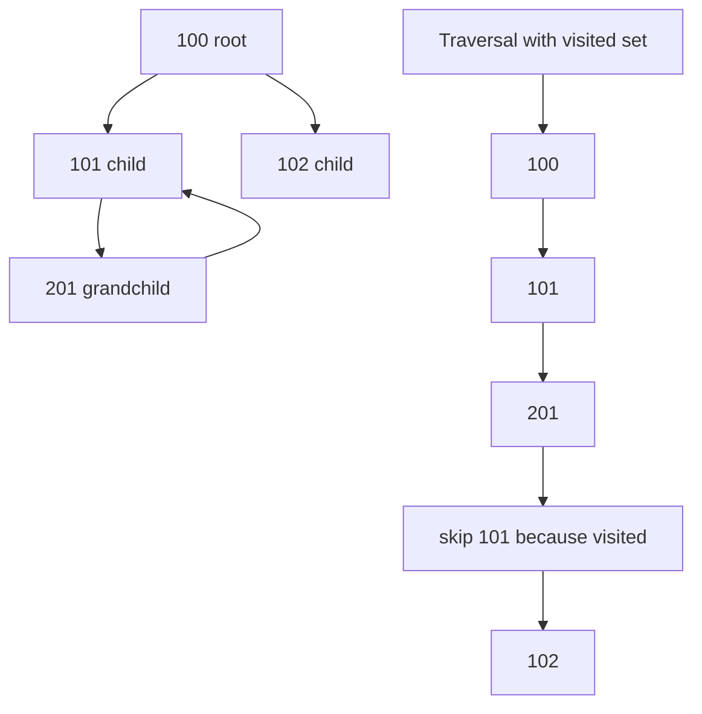

# Add Cycle Guard to Process Tree Traversal

Date: 2026-05-25
Planner Model: codex_gpt-5
Review Source: `docs/review/2026-05-24_gemini_3_5_flash.md`

## Execution Skill

Execute this plan with the `implementer` skill. The implementation must follow that
skill's discovery, branch isolation, strict TDD, atomic commit, validation, and
review-gate workflow, while also honoring this repository's `AGENTS.md` protocol.

## Problem Definition

`py_modules/sdh_ludusavi/service.py::_process_tree()` snapshots `/proc`, builds a
parent-to-children mapping, and recursively walks from a root PID:

```python
def visit(target_pid: int) -> None:
    ordered.append(target_pid)
    for child_pid in sorted(children_by_parent.get(target_pid, [])):
        visit(child_pid)
```

Real Linux parent pointers should form a tree at a moment in time, but `/proc` is
dynamic and this code also has unit-test seams that can simulate impossible or
transient graphs. If a cycle enters `children_by_parent`, recursion can loop until
`RecursionError`. A duplicated PID can also be signaled multiple times.

The traversal should be cycle-safe and should preserve the current order for normal
trees: root first, then children in sorted pre-order.

## Architecture Overview

Add visited tracking to `_process_tree()`. An iterative depth-first traversal is
preferred because it handles both graph cycles and very deep trees without relying on
Python recursion depth.



Expected output for the graph above:

```python
[100, 101, 201, 102]
```

## Core Data Structures

- `visited: set[int]`: tracks PIDs already appended to `ordered`.
- `ordered: list[int]`: existing ordered signal target list.
- `children_by_parent: dict[int, list[int]]`: existing process graph snapshot.
- Optional `stack: list[int]`: iterative DFS worklist.

## Public Interfaces

No public API changes.

Internal behavior change:

- `_process_tree(pid)` returns each reachable PID at most once.
- `_send_signal_tree(pid, sig)` therefore sends at most one signal per PID.
- `_child_pids(pid)` continues to return `_process_tree(pid)[1:]`.

## Implementation Steps

1. Add a failing service test that creates a cycle through mocked `_read_ppid()`.
2. Replace recursive `visit()` with either:
   - recursive `visit()` plus `visited`, or
   - iterative DFS plus `visited`.
3. Prefer iterative DFS:
   - append children to the stack in reverse sorted order
   - pop from the end to preserve ascending sorted traversal
4. Preserve fallback behavior when `os.listdir("/proc")` fails.
5. Preserve skipping vanished processes where `_read_ppid()` returns `None`.
6. Keep `_send_signal_tree()` unchanged unless a test reveals duplicate signal calls.

## Example Code

```python
ordered: list[int] = []
visited: set[int] = set()
stack = [pid]

while stack:
    target_pid = stack.pop()
    if target_pid in visited:
        continue
    visited.add(target_pid)
    ordered.append(target_pid)

    children = sorted(children_by_parent.get(target_pid, []), reverse=True)
    stack.extend(children)

return ordered
```

For the existing normal tree:

```python
children_by_parent = {
    100: [101, 102],
    101: [201],
}
```

the stack order yields:

```python
[100, 101, 201, 102]
```

which matches existing tests.

## Testing Strategy

Strict TDD applies because this changes process traversal behavior.

Add tests to `tests/test_service.py`.

Test 1: cyclic graph does not recurse forever.

```python
def test_process_tree_ignores_cycles(monkeypatch: pytest.MonkeyPatch) -> None:
    import sdh_ludusavi.service as svc_mod

    parents = {
        "100": 1,
        "101": 100,
        "201": 101,
        "102": 100,
        # Impossible graph edge introduced through mocked parent lookup:
        # make 101 also reachable from 201 by representing 101 as 201's child
    }

    children_by_status = {
        "100": "PPid:\t1\n",
        "101": "PPid:\t201\n",
        "201": "PPid:\t101\n",
        "102": "PPid:\t100\n",
    }
```

Because each PID can only have one parent in the actual input mapping, build the mock
so the selected root participates in a reachable cycle. One workable fixture:

```python
proc_status = {
    "100": "PPid:\t201\n",
    "101": "PPid:\t100\n",
    "201": "PPid:\t101\n",
    "102": "PPid:\t100\n",
}
```

Starting from `100`, the traversal should return each PID once:

```python
assert svc_mod._process_tree(100) == [100, 101, 201, 102]
```

Test 2: duplicate-signal prevention.

```python
def test_send_signal_tree_signals_each_pid_once_for_cycle(monkeypatch: pytest.MonkeyPatch) -> None:
    signals: list[tuple[int, signal.Signals]] = []
    monkeypatch.setattr("sdh_ludusavi.service.os.kill", lambda pid, sig: signals.append((pid, sig)))
    # Reuse the cyclic _process_tree fixture or monkeypatch _process_tree to include duplicates.
    ...
    assert len([pid for pid, _sig in signals if pid == 101]) == 1
```

If `_process_tree()` itself guarantees uniqueness, testing `_process_tree()` may be
enough; duplicate signal prevention can stay covered indirectly.

Existing tests that must continue passing:

- `test_process_tree_reads_proc_filesystem`
- `test_process_tree_skips_vanished_processes`
- `test_process_tree_falls_back_on_listdir_failure`
- `test_pause_and_resume_game_process_signal_process_tree`
- `test_signal_process_tree_snapshots_process_table_once`

## Validation

Targeted validation:

```bash
./run.sh uv run pytest tests/test_service.py::test_process_tree_reads_proc_filesystem tests/test_service.py::test_process_tree_skips_vanished_processes tests/test_service.py::test_process_tree_falls_back_on_listdir_failure tests/test_service.py::test_pause_and_resume_game_process_signal_process_tree tests/test_service.py::test_signal_process_tree_snapshots_process_table_once
```

After adding new cycle tests, include their exact names in the targeted run or run:

```bash
./run.sh uv run pytest tests/test_service.py
```

Full validation before commit:

```bash
./run.sh uv run ruff check . --fix
./run.sh uv run ruff format .
./run.sh uv run ty check py_modules/sdh_ludusavi/
./run.sh uv run pytest
```

## Acceptance Criteria

- `_process_tree()` cannot raise `RecursionError` from a cyclic graph.
- Each reachable PID appears at most once in `_process_tree()` output.
- Normal process trees keep the existing root-first, sorted pre-order traversal.
- Existing pause/resume signal ordering remains unchanged for acyclic trees.
- `/proc` read failures and vanished-process behavior remain unchanged.
