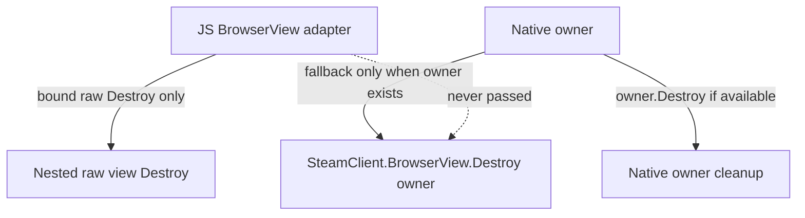

# Fix Unload Cancellation and BrowserView Native Destroy Boundaries

## Objective

Implement the follow-up code review fixes on `fix-review-plan-issues`:

1. Ensure `Plugin._unload()` still runs backend stop cleanup if the unload coroutine is cancelled while awaiting the offloaded stop call.
2. Ensure `SteamClient.BrowserView.Destroy` is never called with the JavaScript adapter object returned by BrowserView normalization.

## Execution Skill

This implementation uses the `implementer` skill. The change will follow strict TDD, keep edits scoped to the reviewed functions and their tests, validate through the repository wrapper, and commit using Conventional Commits.

## Scope

In scope:

- `main.py`: cancellation-resilient unload stop cleanup.
- `src/index.tsx`: native BrowserView destroy fallback guard.
- `tests/test_main.py`: regression test for unload cancellation fallback.
- `tests/test_frontend_static.py`: static regression fence for native BrowserView destroy arguments.
- `docs/agent_conversations/`: session log.

Out of scope:

- Public API changes.
- Third-party dependency changes.
- Broader BrowserView lifecycle refactors.
- Changes to `SDHLudusaviService.stop()` behavior.

## Phases

### Phase 1: Red Tests

- Add a unit test where `Plugin._call("unload_stop", backend.stop)` raises `asyncio.CancelledError`.
- Assert `_unload()` executes `backend.stop()` synchronously before propagating cancellation.
- Assert the final unload log still happens.
- Update the BrowserView static test to reject `SteamClient.BrowserView.Destroy` calls that fall back to the adapter object.
- Verify the new tests fail against the current implementation.

## Phase 2: Implementation

- Wrap the offloaded unload stop call in `try/except asyncio.CancelledError`.
- On cancellation, log a warning and call `backend.stop()` synchronously inside the same guarded fallback used by the failed-result path.
- Keep cancellation semantics honest by re-raising `asyncio.CancelledError` after cleanup.
- Move final unload logging into `finally` so it happens after success, failure fallback, and cancellation fallback.
- Change BrowserView native destroy to call `SteamClient.BrowserView.Destroy` only when `browserViewOwner` is present.

## Phase 3: Validation

- Run targeted tests:
  - `./run.sh uv run pytest tests/test_main.py::test_unload_cancellation_runs_synchronous_stop_before_reraising`
  - `./run.sh uv run pytest tests/test_frontend_static.py::test_frontend_status_strip_destroy_disposes_owner_and_nested_view`
- Run quality gates:
  - `./run.sh uv run ruff check . --fix`
  - `./run.sh uv run ruff format .`
  - `./run.sh uv run ty check py_modules/sdh_ludusavi/`
  - `./run.sh uv run pytest`
  - `./run.sh pnpm run typecheck`
  - `./run.sh pnpm run verify`

## Architecture Overview

```mermaid
flowchart TD
  unload[Plugin._unload] --> call[await _call unload_stop]
  call -->|success| done[final unload log]
  call -->|failed dict| fallback[synchronous backend.stop]
  call -->|CancelledError| cancelFallback[synchronous backend.stop]
  fallback --> done
  cancelFallback --> reraises[re-raise CancelledError]
  reraises --> done
```

BrowserView destruction remains owner-first:



## Testing Strategy

- Python behavior test covers cancellation during unload and confirms fallback cleanup is attempted.
- Static frontend test guards the native destroy argument because the Steam Client BrowserView API is not available under pytest.
- Existing unload failure and BrowserView nested destroy tests continue to cover non-cancellation paths.
