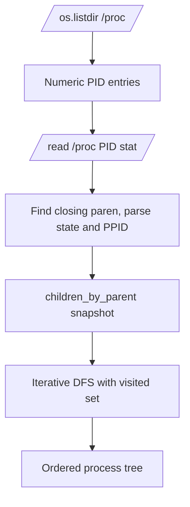

# Optimize Process Tree Parent PID Reads With `/proc/<pid>/stat`

## Objective

Replace `_process_tree()` parent-PID discovery from multiline `/proc/<pid>/status`
parsing to lighter `/proc/<pid>/stat` parsing while preserving existing behavior
for vanished processes, malformed process metadata, cycle safety, and fallback when
`/proc` cannot be listed.

## Execution Skill

This implementation uses the `implementer` skill. The change will be test-first,
scoped to process tree parent-PID discovery, validated through `./run.sh`, and
committed using Conventional Commits.

## Scope

In scope:

- `py_modules/sdh_ludusavi/service.py::_read_ppid`
- `_process_tree()` behavior that depends on `_read_ppid`
- `tests/test_service.py` process-tree and PPID reader coverage
- Session log under `docs/agent_conversations/`

Out of scope:

- Public API changes
- New dependencies
- Broader process signaling semantics
- Frontend changes
- Watchdog behavior changes

## Problem Definition

`_process_tree()` scans numeric entries under `/proc` and reads each process's
parent PID. The current `_read_ppid()` opens `/proc/<pid>/status` and scans lines
until `PPid:` appears. This is correct and readable, but `/proc/<pid>/stat` exposes
the same PPID in a compact single-line format and avoids scanning multiline status
content for every process.

The caveat is that `/proc/<pid>/stat` cannot be parsed with naive whitespace
splitting because the process name field is enclosed in parentheses and may contain
spaces or parentheses. The parser must find the final `)` ending the comm field,
then parse fields after it.

## Architecture Overview



## Core Data Structures

- `children_by_parent: dict[int, list[int]]`
  - Existing snapshot map from parent PID to child PIDs.
- `ordered: list[int]`
  - Existing traversal result.
- `visited: set[int]`
  - Existing cycle guard.

No new persistent data structures are required.

## Public Interfaces

No public interfaces change.

Internal helper behavior changes:

```python
def _read_ppid(pid_str: str, *, proc_root: str = "/proc") -> int | None:
    """Read the parent PID from /proc/<pid>/stat."""
```

The return contract remains unchanged:

- `int` parent PID on success.
- `None` for vanished processes, unreadable files, malformed stat content, or
  invalid numeric PPID fields.

## Dependency Requirements

No new dependencies.

## Testing Strategy

Red tests:

- `_read_ppid()` reads `/proc/<pid>/stat`, not `/proc/<pid>/status`.
- `_read_ppid()` correctly parses process names with spaces and parentheses.
- `_read_ppid()` returns `None` for malformed stat content.
- `_process_tree()` continues to build the correct ordered tree through the
  optimized reader.

Validation:

```bash
./run.sh uv run pytest tests/test_service.py::test_read_ppid_parses_stat_file
./run.sh uv run pytest tests/test_service.py::test_process_tree_reads_proc_filesystem
./run.sh uv run pytest tests/test_service.py
./run.sh uv run ruff check . --fix
./run.sh uv run ruff format .
./run.sh uv run ty check py_modules/sdh_ludusavi/
./run.sh uv run pytest
```
