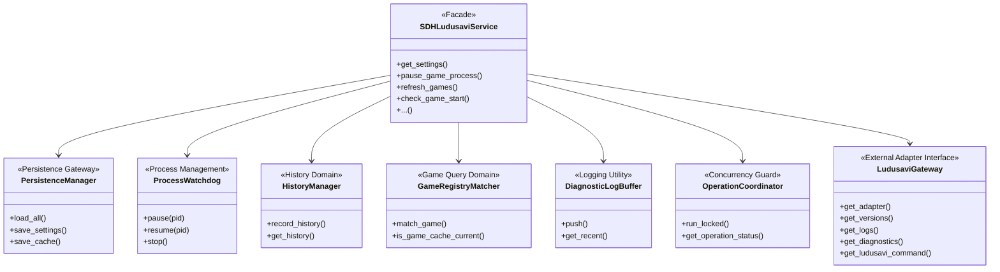

# Plan: Decomposition of SDHLudusaviService (SRP Refactoring)

## Problem Definition
`SDHLudusaviService` inside [service.py](file:///home/beallio/Dropbox/Scripts/SDH-ludusavi/py_modules/sdh_ludusavi/service.py) is a monolithic "God Object" of approximately 1,400 lines (out of 1,755 total lines in the file). It violates the **Single Responsibility Principle (SRP)** by coordinating the following distinct domains:
1.  **Configuration & Settings:** Coercion and persistence of plugin settings.
2.  **Runtime Cache Persistence:** Serialization and persistence of dynamically discovered game cache, aliases, IDs, and metadata.
3.  **Process Management & Watchdog:** Suspending/resuming game process trees (`SIGSTOP`/`SIGCONT`) and running a background thread monitoring for long-running pauses.
4.  **Operation History:** Validating, mapping, sorting, and persisting a chronological list of backup/restore events per game.
5.  **Game Matching & Fuzzy Filtering:** Normalizing input game names and matching them against cache or aliases using length-based fuzzy rules.
6.  **Logging Buffer:** Setting up unified logger overrides and holding a diagnostic ring buffer for RPC log retrieval.
7.  **Operation Coordination:** Thread-safe operation locking and state updates during Ludusavi execution.
8.  **Ludusavi Runtime & Adapter Gateway:** Lazily initializing the underlying Ludusavi wrapper (`LudusaviAdapter`), resolving paths/commands, reading configuration modification times, and retrieving diagnostic information.

This high level of coupling makes the service difficult to test (requiring complex mocks for simple helper unit tests), increases the risk of regression in unrelated areas, and complicates lock management.

---

## Measurable Targets
*   **Code Reduction:** Reduce `SDHLudusaviService` in `service.py` to under **400 lines of code**, serving strictly as a high-level facade and initialization coordinator.
*   **Test Isolation:** Ensure all logic (fuzzy matching, process signaling, history verification) has dedicated unit tests independent of the full `SDHLudusaviService` instantiation.

---

## Architecture Overview
To achieve SRP, we will decompose `SDHLudusaviService` into separate, single-responsibility components and delegate responsibilities through composition. 



---

## Decomposed Components

### 1. `PersistenceManager`
Manages the split settings vs. cache files or the combined single state file. Exposes standard interfaces for reading and writing data safely.
*   **Interface:**
    *   `load_all() -> dict[str, Any]` (loads both settings and cache payloads)
    *   `save_settings(settings: dict[str, Any]) -> None`
    *   `save_cache(cache: dict[str, Any]) -> None`

### 2. `ProcessWatchdog`
Handles checking/signaling process trees and launching the daemon watchdog loop. To keep responsibility boundaries clean and avoid circular dependencies, the `ProcessWatchdog` does not access internal service flags directly. Instead, it will receive an injected callback (e.g., `is_operation_running: Callable[[], bool]`) or query the lock/status from `OperationCoordinator` to determine if a Ludusavi operation is active before auto-resuming a process.
*   **Interface:**
    *   `pause(pid: int) -> dict[str, object]`
    *   `resume(pid: int) -> dict[str, object]`
    *   `stop() -> None`

### 3. `HistoryManager`
Validates, formats, and tracks operation records for games.
*   **Interface:**
    *   `record_history(game_name: str, op: str, trigger: str, status: str, ...)`
    *   `get_history() -> dict[str, dict[str, Any]]`

### 4. `GameRegistryMatcher`
Contains name normalization, fuzzy checks, cache freshness logic, and alias matching heuristics.
*   **Interface:**
    *   `match_game(game_name: str, app_id: str | None, games: dict, aliases: dict) -> GameStatus | None`
    *   `is_game_cache_current(cached_games: dict, installed_ids: str | None, current_mtime: int | None) -> bool`

### 5. `DiagnosticLogBuffer`
Routes custom standard logs to Decky's native logger and holds the memory ring buffer.
*   **Interface:**
    *   `push(level: str, msg: str, operation: str | None, game: str | None) -> None`
    *   `get_recent() -> list[dict[str, object]]`

### 6. `OperationCoordinator`
Coordinates thread-safe operation locking and encapsulates the execution lock state.
*   **Interface:**
    *   `run_locked(operation: str, game_name: str | None, callback: Callable) -> Any`
    *   `get_status() -> dict[str, object]`

### 7. `LudusaviGateway`
Manages the mockable `LudusaviAdapter` instance, resolves path variables, caches versions, parses flatpak environments, discovers command inputs, and fetches execution logs.
*   **Interface:**
    *   `get_adapter() -> LudusaviAdapter`
    *   `get_versions() -> dict[str, str]`
    *   `get_logs() -> str`
    *   `get_diagnostics() -> dict[str, object]`
    *   `get_ludusavi_command() -> dict[str, object] | None`

---

## Public API Inventory & Compatibility Assurance

To ensure absolute compatibility with [main.py](file:///home/beallio/Dropbox/Scripts/SDH-ludusavi/main.py), `SDHLudusaviService` will expose the following 29 public methods exactly as they exist today. Each method will delegate its core logic directly to the composed managers:

1.  `__init__(self, adapter=None, adapter_factory=None, state_path=None, settings_store=None, cache_path=None, log_limit=100)`
2.  `stop(self) -> None`
3.  `log(self, level: str, message: str, operation: str | None = None, game_name: str | None = None) -> None`
4.  `get_settings(self) -> dict[str, Any]`
5.  `set_auto_sync_enabled(self, enabled: bool) -> dict[str, Any]`
6.  `set_selected_game(self, game_name: str) -> dict[str, Any]`
7.  `set_notification_settings(self, settings: dict[str, object]) -> dict[str, Any]`
8.  `get_game_history(self) -> dict[str, dict[str, Any]]`
9.  `get_ludusavi_launcher_shortcut_id(self) -> int`
10. `set_ludusavi_launcher_shortcut_id(self, app_id: int) -> bool`
11. `clear_ludusavi_launcher_shortcut_id(self) -> bool`
12. `get_ludusavi_command(self) -> dict[str, object] | None`
13. `is_game_cache_current(self, installed_app_ids: str | None = None) -> bool`
14. `refresh_games(self, force: bool = False, installed_app_ids: str | None = None) -> dict[str, object]`
15. `check_game_start(self, game_name: str, app_id: str | None = None) -> dict[str, object]`
16. `resolve_game_start_conflict(self, game_name: str, app_id: str | None, resolution: str) -> dict[str, object]`
17. `restore_game_on_start(self, game_name: str, app_id: str | None = None) -> dict[str, object]`
18. `handle_game_start(self, game_name: str, app_id: str | None = None) -> dict[str, object]`
19. `check_game_exit(self, game_name: str, app_id: str | None = None) -> dict[str, object]`
20. `backup_game_on_exit(self, game_name: str, app_id: str | None = None) -> dict[str, object]`
21. `handle_game_exit(self, game_name: str, app_id: str | None = None) -> dict[str, object]`
22. `force_backup(self, game_name: str) -> dict[str, object]`
23. `force_restore(self, game_name: str) -> dict[str, object]`
24. `get_versions(self) -> dict[str, str]`
25. `get_ludusavi_logs(self) -> str`
26. `get_operation_status(self) -> dict[str, object]`
27. `get_recent_logs(self) -> list[dict[str, object]]`
28. `resume_game_process(self, pid: int) -> dict[str, object]`
29. `pause_game_process(self, pid: int) -> dict[str, object]`

---

## Testing & TDD Strategy

We will strictly follow the Red-Green-Refactor TDD lifecycle for this refactoring:

1.  **Red (Failing Tests First):**
    Before any implementation code is modified or moved, we will write our tests:
    *   **Manager Unit Tests:** New tests for each manager (`test_process_watchdog.py`, `test_game_matcher.py`, etc.) targeting the extracted functions/classes.
    *   **Facade Compatibility Tests (`tests/test_compatibility.py`):**
        This suite will instantiate `SDHLudusaviService` directly to assert that its 29 public methods preserve signature and default delegation contracts. We will also monkeypatch `SDHLudusaviService` on the `Plugin` class to verify correct delegation from the RPC boundaries in `Plugin` without mutating state on disk.
    *   Run tests to verify failures:
        ```bash
        ./run.sh uv run pytest
        ```
2.  **Green (Implement Decomposition):**
    Extract responsibilities to the manager classes, wire them up in `SDHLudusaviService`, and implement minimal code to satisfy the tests.
3.  **Refactor:**
    Clean up imports, formatting, and locks while keeping the test suite green.

---

## Protocol Validation Commands
Before any commits are made, the code must pass the following local quality checks:
```bash
./run.sh uv run ruff check . --fix
./run.sh uv run ruff format .
./run.sh uv run ty check py_modules/sdh_ludusavi/
./run.sh uv run pytest
```
