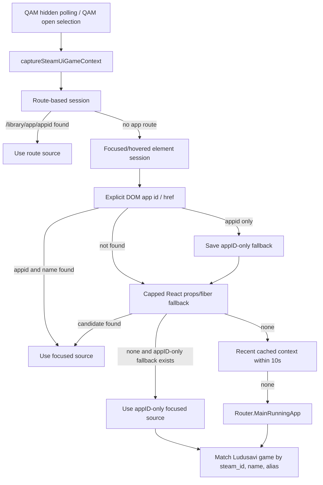

# Harden SteamUI QAM Game Context Detection

## Problem Definition

Review finding:

> The `getSteamUiReactPropCandidates` function relies on internal React property
> names like `__reactProps$` and `__reactFiber$`, and performs deep traversal of
> the fiber tree. This is extremely fragile and likely to break with Steam UI or
> React updates. The plugin should transition to more stable methods of
> identifying the focused game context if possible, or at least harden this
> traversal.

Requested change:

- Harden the React property discovery logic.
- Consider using a more limited and targeted approach to finding game data in
  the DOM.
- Add safeguards to prevent infinite or excessively deep fiber traversal.

Acceptance criteria:

- The logic is less dependent on hardcoded internal React property patterns.
- Traversal depth is strictly capped.
- The QAM still correctly identifies the focused game.

Review judgment:

- I agree that depending on private React property names and SteamUI component
  prop shapes is fragile. These are not stable Decky or Steam APIs.
- I agree that the current tests overfit the implementation strings and should
  pin safety limits, fallback order, and user-visible behavior instead.
- I disagree that the current traversal is unbounded. The live code already caps
  fiber traversal at `depth < 12`, and it only checks active, focused, and
  hovered elements rather than the entire DOM.
- I disagree with removing the React fallback outright unless a stable focused
  Home/Library tile API is found. `Router.MainRunningApp` only covers running
  games, while route/store APIs only cover route-selected Library contexts.

## Architecture Overview

Keep the existing capability but make the unstable part explicitly secondary,
bounded, and isolated.



Resolver order:

1. Prefer route context, because `/library/app/<appid>` is explicit and does
   not require React internals.
2. Try focused or hovered element context through explicit DOM app attributes or
   app route hrefs. Return immediately only when both app ID and a non-empty
   store-resolved name are available.
3. If the DOM path only provides an app ID, save it as a deferred fallback and
   continue to React candidates. This preserves `steam_id` matching without
   suppressing richer React prop data that may include the game name.
4. Use React private prop/fiber scraping only as a best-effort focused-tile
   fallback.
5. Fall back to recently cached SteamUI context within the existing TTL.
6. Fall back to `Router.MainRunningApp` for active running games.

This preserves Home/Library focused-game detection while making the fragile
fallback easier to reason about and safer under SteamUI changes.

## Core Data Structures

No persisted state changes.

Existing `RunningSession` remains unchanged:

```ts
export type RunningSession = {
  appID: string;
  name: string;
  source?: "focused" | "route" | "cached" | "running";
};
```

Add named constants near the existing SteamUI context constants:

```ts
const STEAM_UI_REACT_FIBER_MAX_DEPTH = 12;
const STEAM_UI_REACT_CANDIDATE_MAX_COUNT = 64;
const STEAM_UI_HOVERED_ELEMENT_MAX_COUNT = 4;
const STEAM_UI_APP_ROUTE_PATTERN = /(?:\/routes)?\/library\/app\/(\d+)/;
const STEAM_UI_REACT_PROPS_PREFIX = "__reactProps$";
const STEAM_UI_REACT_FIBER_PREFIXES = [
  "__reactFiber$",
  "__reactInternalInstance$",
];
```

The exact candidate cap can be adjusted during implementation if static source
constraints make a lower or higher value cleaner, but it must remain fixed,
named, and tested.

## Public Interfaces

No backend RPC, settings schema, dependency, or user-facing UI changes.

Frontend helper changes in `src/utils/steam.ts`:

- Add `getSteamUiFocusedElements(doc: Document): Element[]`.
- Add `sessionFromElementAppContext(element: Element | null): RunningSession | null`.
- Keep `getSteamUiReactPropCandidates(element)` exported for tests/static
  regression coverage.
- Keep `sessionFromSteamUiCandidate(candidate)` behavior compatible with current
  SteamUI candidate shapes.
- Change `captureSteamUiGameContext()` to try route context before focused
  React/DOM context.

## Implementation Details

### Focused Element Collection

Create a small helper that deduplicates and limits candidate elements. This
keeps the DOM surface narrow and prevents a large hover stack from expanding the
React fallback work.

Filter out `BODY` and `HTML`. `doc.activeElement` can fall back to `BODY` when
the SteamUI window loses focus; probing descendants or React props from those
root elements would broaden the search to unrelated app links or root React
state.

Example:

```ts
function getSteamUiFocusedElements(doc: Document): Element[] {
  const elements = [
    doc.activeElement,
    doc.querySelector(".gpfocus, .gpfocuswithin, :focus"),
    ...Array.from(doc.querySelectorAll(":hover"))
      .reverse()
      .slice(0, STEAM_UI_HOVERED_ELEMENT_MAX_COUNT),
  ];

  const unique: Element[] = [];
  for (const element of elements) {
    if (
      element &&
      element.tagName !== "BODY" &&
      element.tagName !== "HTML" &&
      !unique.includes(element)
    ) {
      unique.push(element);
    }
  }
  return unique;
}
```

### Explicit DOM App Context

Before probing React internals, inspect only explicit app identifiers on the
focused/hovered element, close ancestors, or descendants. Do not infer a game
from text, labels, title attributes, or aria text because those are more likely
to create false positives.

Use `closest()` first because it preserves the current focused-card context. If
that fails, query descendants because SteamUI focus classes can be applied to a
parent card while route links or app-id attributes live on child image/link
elements.

Return a DOM session immediately only if a non-empty name can be resolved. If
only an app ID is available, keep that appID-only session as a deferred fallback
after React prop/fiber candidates. This matters because the live matcher checks
`steam_id` first, so appID-only context is still useful, but name-bearing React
props are better for name and alias matching.

Example:

```ts
function sessionFromElementAppContext(element: Element | null): RunningSession | null {
  const selector = "[data-appid], [data-app-id], [href]";
  const appElement = element?.closest(selector) ?? element?.querySelector(selector) ?? null;
  const href = appElement?.getAttribute("href") ?? "";
  const appID =
    appElement?.getAttribute("data-appid") ??
    appElement?.getAttribute("data-app-id") ??
    href.match(STEAM_UI_APP_ROUTE_PATTERN)?.[1] ??
    null;

  if (!appID) {
    return null;
  }

  const name = getSteamAppNameFromStores(appID) ?? "";
  return {
    appID,
    name,
    source: "focused",
  };
}
```

### Capped React Fallback

Keep React-private discovery as a best-effort fallback, but isolate the private
key names behind constants, enforce a candidate cap, and track visited fibers so
malformed cyclic `return` links cannot repeat work until the depth cap.

Example:

```ts
function pushSteamUiCandidate(candidates: any[], value: any): boolean {
  if (value) {
    candidates.push(value);
  }
  return candidates.length < STEAM_UI_REACT_CANDIDATE_MAX_COUNT;
}

export function getSteamUiReactPropCandidates(element: Element | null): any[] {
  if (!element) {
    return [];
  }

  const candidates: any[] = [];
  for (const key of Object.keys(element as any)) {
    if (candidates.length >= STEAM_UI_REACT_CANDIDATE_MAX_COUNT) {
      break;
    }

    if (key.startsWith(STEAM_UI_REACT_PROPS_PREFIX)) {
      if (!pushSteamUiCandidate(candidates, (element as any)[key])) {
        break;
      }
      continue;
    }

    if (!STEAM_UI_REACT_FIBER_PREFIXES.some((prefix) => key.startsWith(prefix))) {
      continue;
    }

    let fiber = (element as any)[key];
    const visitedFibers = new Set<any>();
    for (
      let depth = 0;
      fiber && depth < STEAM_UI_REACT_FIBER_MAX_DEPTH && !visitedFibers.has(fiber);
      depth += 1
    ) {
      visitedFibers.add(fiber);
      if (!pushSteamUiCandidate(candidates, fiber.pendingProps)) break;
      if (!pushSteamUiCandidate(candidates, fiber.memoizedProps)) break;
      if (!pushSteamUiCandidate(candidates, fiber.stateNode?.props)) break;
      fiber = fiber.return;
    }
  }

  return candidates.filter(Boolean);
}
```

### Resolver Flow

Route focused session extraction through the safer explicit DOM path first, then
React fallback. Do not immediately return an appID-only DOM session. Save it and
return it only if React candidates do not provide a richer session.

Example:

```ts
export function getFocusedSteamGameSession(): RunningSession | null {
  const mainWindow = getMainSteamWindow();
  const doc = mainWindow?.document ?? document;

  for (const element of getSteamUiFocusedElements(doc)) {
    const domSession = sessionFromElementAppContext(element);
    const appIDOnlyFallback = domSession?.name ? null : domSession;
    if (domSession?.name) {
      return domSession;
    }

    for (const candidate of getSteamUiReactPropCandidates(element)) {
      const session = sessionFromSteamUiCandidate(candidate);
      if (session) {
        return { ...session, source: "focused" };
      }
    }

    if (appIDOnlyFallback) {
      return appIDOnlyFallback;
    }
  }

  return null;
}

export function captureSteamUiGameContext(): RunningSession | null {
  const session = getRouteSteamGameSession() ?? getFocusedSteamGameSession();
  // Existing cache/logging behavior remains unchanged.
}
```

## Testing Strategy

Follow red-green-refactor. Add failing static tests before implementation.

| Scenario | Expected Result |
|---|---|
| Route has `/library/app/<appid>` | Route session is tried before focused React scraping |
| Focused element has explicit app id and resolvable name | DOM context is used without requiring React private keys |
| Focused element has explicit app id but no resolvable name | React candidates are tried before the appID-only DOM fallback |
| Focused parent has child route/app-id link | Descendant lookup finds the explicit app context |
| Active element is `BODY` or `HTML` | Root element is ignored before DOM or React probing |
| React props contain app overview | Focused context still resolves as before |
| Fiber chain exceeds max depth | Traversal stops at named depth constant |
| Fiber chain cycles through `return` | Traversal stops via visited-fiber guard |
| Too many candidates | Candidate collection stops at fixed cap |
| No focused/route context | Recent cached context then `Router.MainRunningApp` still applies |

Static tests to add or update in `tests/test_frontend_static.py`:

- Assert named constants exist: `STEAM_UI_REACT_FIBER_MAX_DEPTH`,
  `STEAM_UI_REACT_CANDIDATE_MAX_COUNT`, and
  `STEAM_UI_HOVERED_ELEMENT_MAX_COUNT`.
- Assert `captureSteamUiGameContext()` evaluates `getRouteSteamGameSession()`
  before `getFocusedSteamGameSession()`.
- Assert `getSteamUiFocusedElements()` filters `BODY` and `HTML`.
- Assert `sessionFromElementAppContext()` searches both `closest(...)` and
  `querySelector(...)`.
- Assert a name-bearing DOM session returns before
  `getSteamUiReactPropCandidates()`.
- Assert an appID-only DOM session is saved as `appIDOnlyFallback` and returned
  only after React candidates are checked.
- Assert the fiber loop includes both the max-depth guard and visited-fiber
  guard.
- Update the existing React-private-key assertion so it documents that private
  React keys remain as a fallback, not the primary resolver path.

Manual Steam Deck acceptance:

- From a running game, open QAM and confirm the dropdown selects that game.
- From a Library app detail route, open QAM and confirm the dropdown selects
  that app.
- From Home/Library focused tile before launching, open QAM and confirm the
  dropdown still selects the focused game.
- Test a known alias case, such as the prior `Xmen origins Wolverine` scenario,
  and confirm logs show `reason=alias` when appropriate.
- Confirm no noisy repeated warning logs appear during hidden QAM polling.

Validation commands:

```bash
./run.sh uv run pytest tests/test_frontend_static.py -k "focused_game_context or resolves_selected_library_route_app_context or prefers_focused_or_selected_game"
./run.sh pnpm run typecheck
./run.sh uv run ruff check . --fix
./run.sh uv run ruff format .
./run.sh uv run ty check py_modules/sdh_ludusavi/
./run.sh uv run pytest
./run.sh pnpm run verify
```

If `pnpm verify` fails with `EAI_AGAIN registry.npmjs.org`, treat it as the
known network/audit failure mode and rerun the same verification path with
network access instead of changing code.

## Dependency Requirements

No new dependencies.

This remains frontend-only and uses existing Steam/Decky surfaces:

- Route path inspection from `Router.WindowStore`.
- App names from `appStore` and `collectionStore`.
- Running game fallback from `Router.MainRunningApp`.
- Existing QAM visibility polling path.

## Documentation and Session Logging

After implementation:

- Record a session summary under `docs/agent_conversations/`.
- README does not need an update unless the implementation changes visible user
  behavior or usage instructions.

## Assumptions

- No backend RPC, settings schema, or persisted data changes.
- React private-key scraping remains necessary as a fallback for focused
  Home/Library tiles because no stable local Decky API exposes that context.
- AppID-only DOM context remains useful for `steam_id` matching, but it must not
  block React candidate discovery because React props may provide the game name
  needed for name and alias matching.
- The existing 10-second recent-context TTL remains unchanged.
- The current max fiber depth of `12` remains unchanged for compatibility, but
  becomes named and test-pinned.
- The QAM must continue to identify focused games from Home/Library, Library
  route pages, and actively running games.
