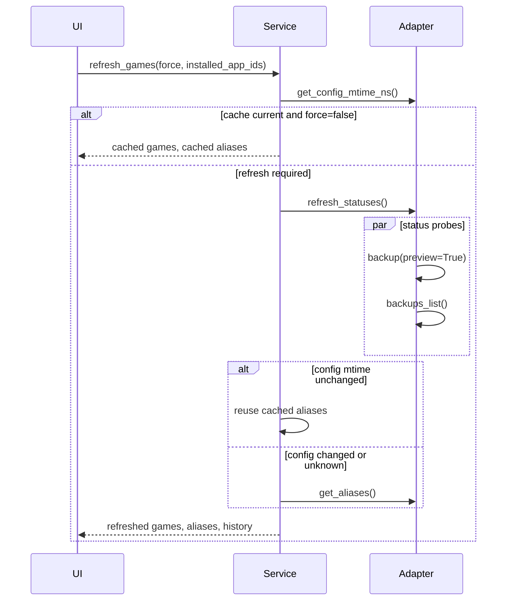

# Refresh Games Ludusavi Call Optimization Plan

## Problem Definition

`SDHLudusaviService.refresh_games()` already avoids a full Ludusavi refresh when the
backend cache is current, but a cache miss still performs more Ludusavi subprocess work
than necessary:

- `PyludusaviAdapter.refresh_statuses()` calls `backup --preview` and `backups`
  sequentially.
- `SDHLudusaviService._refresh_statuses_unlocked()` then calls
  `PyludusaviAdapter.get_aliases()`, which currently runs `config show` every time a
  refresh occurs.

Those calls are read-only, but each Ludusavi process spawn is expensive on Steam Deck,
especially when Flatpak is involved. The goal is to reduce refresh latency without
changing the public RPC contract or weakening cache correctness.

I mostly agree with the review finding in
`docs/review/2026-05-26_refresh_games_performance_review.md`, with two qualifications:

- Agree: a refresh miss currently reaches `py_modules/sdh_ludusavi/ludusavi.py` and
  performs `backup --preview`, `backups`, and `config show`.
- Disagree with the broad "when not forced" wording: `refresh_games(force=False, ...)`
  already returns cached games when installed app IDs and Ludusavi config mtime match.
- Qualify: `get_config_mtime_ns()` is cheap after the config path is cached, but the
  first lookup can still call `ludusavi config path`.

Expected call budget:

| Scenario | Current | Planned |
| --- | ---: | ---: |
| Warm cache hit, `force=false`, markers unchanged | no status/config-show calls | unchanged |
| Refresh needed, config unchanged | preview + backups + config show | preview + backups in parallel; no config show |
| Refresh needed, config changed | preview + backups + config show | preview + backups in parallel; config show reloads aliases |
| Manual force with unchanged config | preview + backups + config show | preview + backups in parallel; aliases reused |

## Architecture Overview

Keep the existing cache-marker architecture:

- The frontend continues to call `is_game_cache_current(installed_app_ids)` before
  warmed refreshes.
- `refresh_games(force, installed_app_ids)` remains the only game refresh RPC.
- `SDHLudusaviService` remains the owner of durable game, alias, history, installed app
  ID, and Ludusavi config mtime cache state.
- `PyludusaviAdapter` remains the only code that talks to pyludusavi/Ludusavi.

Change only the refresh-miss path:



## Core Data Structures

Add private alias-cache fields to `PyludusaviAdapter`:

```python
self._cached_aliases: dict[str, str] | None
self._cached_aliases_mtime_ns: int | None
self._aliases_lock: threading.Lock
```

Rules:

- The cache maps Ludusavi custom game names to canonical Ludusavi titles, matching the
  existing `get_aliases() -> dict[str, str]` contract.
- Return defensive copies so callers cannot mutate adapter cache state.
- Cache aliases only when a concrete config mtime is known.
- If config mtime is unknown or unreadable, do not trust the cache as an invalidation
  source.
- Preserve the service-level durable aliases cache in `_aliases`; the adapter cache is
  only an in-process optimization around `config show`.

Example alias behavior:

```text
mtime=100 -> config_show -> {"Shortcut Name": "The Witcher 3"}
mtime=100 -> cached aliases, no config_show
mtime=101 -> config_show reloads aliases
mtime unavailable -> do not trust alias cache for invalidation
```

## Public Interfaces

No public interface changes are planned.

Unchanged interfaces:

- `PyludusaviAdapter.refresh_statuses() -> list[dict[str, object]]`
- `PyludusaviAdapter.get_aliases() -> dict[str, str]`
- `SDHLudusaviService.refresh_games(force=False, installed_app_ids=None) -> dict[str, object]`
- `main.Plugin.refresh_games(force=False, installed_app_ids=None)`
- Frontend `refreshGamesCall(force, installed_app_ids?)`

No new RPCs, TypeScript types, settings fields, dependencies, or README-visible behavior
are required.

## Dependency Requirements

No new dependencies are needed.

Use only Python standard library concurrency:

- `concurrent.futures.ThreadPoolExecutor` for the two read-only status probes.
- `threading.Lock` for adapter alias-cache state if needed.

Do not modify `py_modules/pyludusavi`. Local source inspection showed the wrapper uses
per-call `subprocess.run()` in `LudusaviExecutor.execute()`, with no shared process
handle, so concurrent read-only calls through the same `Ludusavi` instance are reasonable
to test and use in the adapter.

Bulk `ludusavi api` batching is intentionally out of scope for this pass. The local
wrapper exposes `bulk_api()`, but this codebase does not currently define or test a
stable multi-operation schema for combining `backup --preview` and `backups`.

## Implementation Steps

### 1. Add Red Tests For Alias Caching

Add or extend tests in `tests/test_adapter_cache.py`:

- `get_aliases()` calls `config_show()` the first time and returns parsed aliases.
- A second `get_aliases()` with the same config mtime returns cached aliases without
  calling `config_show()` again.
- Returned alias dictionaries are defensive copies.
- A changed config mtime invalidates the cache and reloads aliases.
- If config mtime cannot be verified, `get_aliases()` does not incorrectly treat stale
  aliases as current.

Keep or update exception-boundary tests in `tests/test_exception_boundaries.py`:

- Ludusavi command errors and config-shape errors still return `{}` or a previous safe
  cached value when appropriate.
- Unrelated programming errors from `config_show()` still propagate.

### 2. Add Red Tests For Service Alias Reuse

Add tests in `tests/test_service.py` proving:

- `_refresh_statuses_unlocked(installed_app_ids, ludusavi_config_mtime_ns=100)` reuses
  existing `self._aliases` when the service already has `_ludusavi_config_mtime_ns == 100`.
- The service calls `get_aliases()` when the marker changes.
- A forced refresh still reuses aliases when the config marker is unchanged, because
  `force` should refresh game status, not force an unnecessary `config show`.
- Unknown config marker behavior remains conservative and reloads aliases.

### 3. Add Red Test For Parallel Status Retrieval

Add an event-coordinated test in `tests/test_ludusavi.py`:

- Fake `backup(preview=True)` blocks until `backups_list()` has started.
- Fake `backups_list()` records that it started and then releases the preview call.
- `refresh_statuses()` should complete and return the same parsed result shape as today.

Avoid sleep-based assertions. Use `threading.Event` so the test proves overlap
deterministically instead of relying on timing.

### 4. Implement Adapter Alias Cache

Update `PyludusaviAdapter.__init__()`:

- Initialize `_cached_aliases`, `_cached_aliases_mtime_ns`, and the lock.

Update `get_aliases()`:

- Read current config mtime with `get_config_mtime_ns()`.
- If mtime is a known integer and matches `_cached_aliases_mtime_ns`, return a copy of
  `_cached_aliases`.
- Otherwise call `self._client.config_show().data`, parse `customGames`, and update the
  cache only when the mtime is known.
- Preserve current narrow exception handling:
  - Catch `LudusaviError`, `KeyError`, `TypeError`, `ValueError`, and `AttributeError`.
  - Do not catch broad `Exception`.
  - Return a previous cached alias copy only if that fallback is safer than returning
    empty because the cache came from a known prior mtime.

### 5. Reuse Service Aliases When Config Marker Is Unchanged

Update `SDHLudusaviService._refresh_statuses_unlocked()`:

- After parsing fresh game statuses, decide whether aliases need reloading.
- Reuse `self._aliases` when `ludusavi_config_mtime_ns` is a known integer and equals
  the already committed `self._ludusavi_config_mtime_ns`.
- Call `get_aliases()` when the config marker changed, is unknown, or the current alias
  state cannot be trusted.
- Commit `_games`, `_aliases`, `_ids`, `_installed_app_ids`, and
  `_ludusavi_config_mtime_ns` under the existing state lock.

### 6. Parallelize Status Probes

Update `PyludusaviAdapter.refresh_statuses()`:

- Use `ThreadPoolExecutor(max_workers=2)` locally inside the method.
- Submit:
  - `self._client.backup(preview=True)`
  - `self._client.backups_list()`
- Read both `.result()` values, then keep the existing parsing/filtering logic.
- Let exceptions propagate as they do today so `refresh_games()` can return the existing
  dependency-error fallback.

Do not change current filtering behavior:

- Only preview games with files or registry entries remain visible.
- `Ignored` and `Cancelled` decisions remain excluded.
- Backup presence still comes from `backups_list()`.

## Testing Strategy

Run targeted tests after the red/green cycle:

```bash
./run.sh uv run pytest tests/test_adapter_cache.py tests/test_ludusavi.py tests/test_exception_boundaries.py tests/test_service.py
```

Run the protocol validation gate before commit:

```bash
./run.sh uv run ruff check . --fix
./run.sh uv run ruff format .
./run.sh uv run ty check py_modules/sdh_ludusavi/
./run.sh uv run pytest
```

If unrelated user-owned files are modified when implementation starts, avoid broad
formatting and format only files touched by this change.

Manual Deck check after implementation:

- Open QAM with a current cache and verify no visible delay.
- Trigger manual Refresh Games and confirm the game list, aliases, and selected-game
  matching still behave normally.
- Change a Ludusavi custom game alias, refresh, and confirm the new alias is reflected.
- Review logs for the existing refresh messages and dependency-error handling.

## Assumptions And Defaults

- This plan addresses backend refresh latency only; frontend QAM warmed-load behavior is
  already guarded by `is_game_cache_current()`.
- Partial per-game refresh is out of scope because full-game refresh is still required
  to discover installed/configured games accurately.
- No README update is needed because behavior and user-facing commands remain unchanged.
- After implementation, record a session log under `docs/agent_conversations/` and commit
  with a Conventional Commit message after the full validation gate passes.
