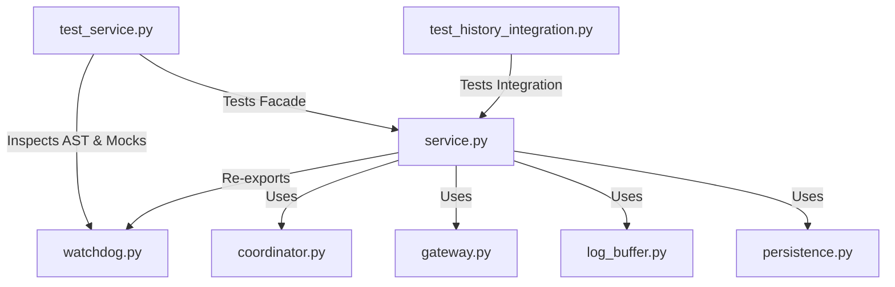

# Plan: Address SRP Decomposition Findings

## Problem Definition
The physical separation of responsibilities from the monolithic `SDHLudusaviService` class into 7 manager modules (under `py_modules/sdh_ludusavi/`) introduced several code review issues (captured in `/tmp/goal/code_review_7cd0f02.md`). Specifically:
1.  **Log Buffer Dead Code:** An unused `limit` parameter is present in `DiagnosticLogBuffer.__init__`.
2.  **Coupling / Trampolining:** `watchdog.py` and `gateway.py` perform `sys.modules.get("sdh_ludusavi.service")` lookup and `__code__` identity trampolining to check if they should redirect calls to `service.py` module-level duplicates.
3.  **Unnecessary Test Mock Redirects:** `_get_service_os()` redirects `os` operations to support mock patching of `sdh_ludusavi.service.os` in tests.
4.  **Aliased Dict Mutability:** In combined storage mode, both `settings` and `cache` dictionaries in `persistence.py` load reference the exact same dict object, violating isolation.
5.  **Assert in Production Code:** `assert` is used for runtime validation of the combined state path in `persistence.py`.
6.  **TOCTOU Race Condition:** `OperationCoordinator.run_locked` checks `is_running` before acquiring the lock without holding it, which is redundant and non-atomic.
7.  **Circular Delegation:** `gateway.py` calls back through the service to log Ludusavi diagnostics during adapter initialization.
8.  **Reduced Test Coverage:** Integration tests for per-game operation history verification (10 tests) were deleted during the refactoring.

## Architecture Overview
We will resolve these design flaws by:
- Eliminating all `sys.modules` lookup/trampolining and `_get_service_os()` helpers in `watchdog.py`.
- Re-exporting watchdog helpers directly from `service.py` to preserve compatibility with existing tests.
- Re-pointing AST checks and monkeypatches in tests directly to the canonical `watchdog.py` module.
- Refining internal logic for `persistence.py` (copying dicts, replacing asserts with runtime errors), `coordinator.py` (removing the pre-lock `is_running` check), and `gateway.py` (calling self diagnostics and direct version lookup).
- Restoring the deleted history integration tests in `tests/test_history_integration.py`.



## Core Data Structures
No changes to core data structures. We will ensure that in combined mode, two independent `dict` instances are returned:
```python
settings = cast(dict[str, Any], dict(data))
cache = cast(dict[str, Any], dict(data))
```

## Public Interfaces
All public methods on the facade `SDHLudusaviService` and decomposed modules are preserved. The `limit` argument is removed from `DiagnosticLogBuffer.__init__`.

## Dependency Requirements
No new dependencies are required. The project environment continues to use `pyludusavi` and standard python libraries.

## Testing Strategy
1.  **AST Target Redirection:** Update AST-based tests (`test_process_tree_has_no_subprocess_usage` and `test_read_ppid_uses_proc_stat_not_status`) to target `watchdog.py`.
2.  **Monkeypatch Redirection:** Update `os.listdir` and `os.kill` monkeypatching to target `sdh_ludusavi.watchdog.os.listdir` and `sdh_ludusavi.watchdog.os.kill`.
3.  **Restore Integration Tests:** Restore the deleted `tests/test_history_integration.py` containing 10 integration tests.
4.  **Linter and Type Checker:** Run quality checks:
    - `./run.sh uv run pytest`
    - `./run.sh uv run ruff check . --fix`
    - `./run.sh uv run ruff format .`
    - `./run.sh uv run ty check py_modules/sdh_ludusavi/`
