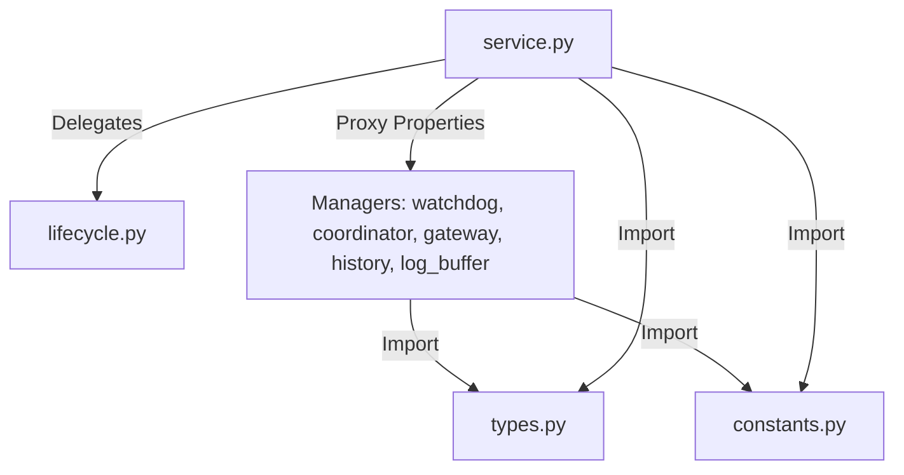

# Plan: Resolve SRP Decomposition Review Findings

## Problem Definition
While the initial refactoring extracted the monolith logic into 7 sub-managers, the managers still act as proxies over shared mutable state owned by `SDHLudusaviService` rather than independent, stateful units. In addition:
- Decomposed modules still import types, protocols, and constants from `service.py`, creating circular package imports.
- `LudusaviGateway.get_adapter` uses `assert` for runtime validation instead of raising a proper error.
- The `SDHLudusaviService` class size is still ~790 lines, failing to meet the <400 LOC target.

## Architecture Overview
We will address these design concerns:
1.  **Extract Shared Entities:** Create `types.py` (protocols and dataclasses) and `constants.py` (shared keys and markers) to break circular module imports.
2.  **Encapsulate State:** Migrate state attributes (e.g. `_paused_pids`, `_operation`, `_adapter`, `_game_history`, `_logs`) to be owned directly by their respective manager classes.
3.  ** facade Property Proxies:** Define getter/setter properties on `SDHLudusaviService` that forward accesses to sub-manager states to preserve full backward compatibility with test suites and external modules.
4.  **Extract Game Lifecycle:** Extract game start/exit lifecycle methods into a new `GameLifecycleManager` under `lifecycle.py` to bring the service facade class under 400 lines.
5.  **Remove GATEWAY Assert:** Raise `RuntimeError` if the adapter factory returns `None` instead of using `assert`.

## Core Data Structures
Shared structures such as `GameStatus` and `LudusaviAdapter` will be defined in `types.py`.
Shared markers such as `CONFIG_MARKER_READ_FAILED` and `CACHE_MARKER_UNCHANGED` will be defined in `constants.py`.

## Public Interfaces
All public methods on the facade `SDHLudusaviService` are preserved. The facade will delegate all 9 game start/exit/backup/restore lifecycle methods to `GameLifecycleManager`.

## Dependency Requirements
No new dependencies are required.

## Testing Strategy
- Ensure all unit and integration tests run successfully: `./run.sh uv run pytest`
- Verify that linter (`ruff check`) and type checker (`ty check`) pass cleanly.
