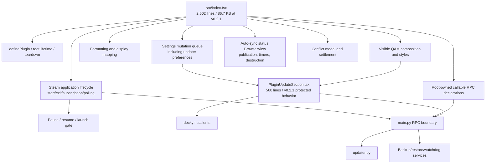
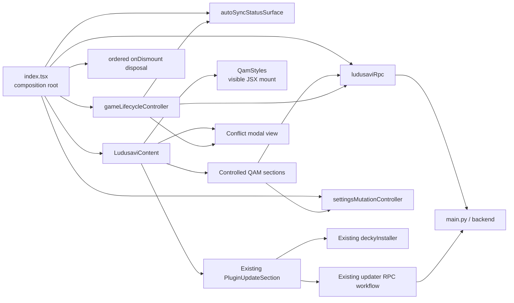
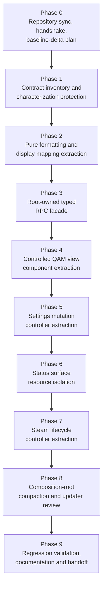
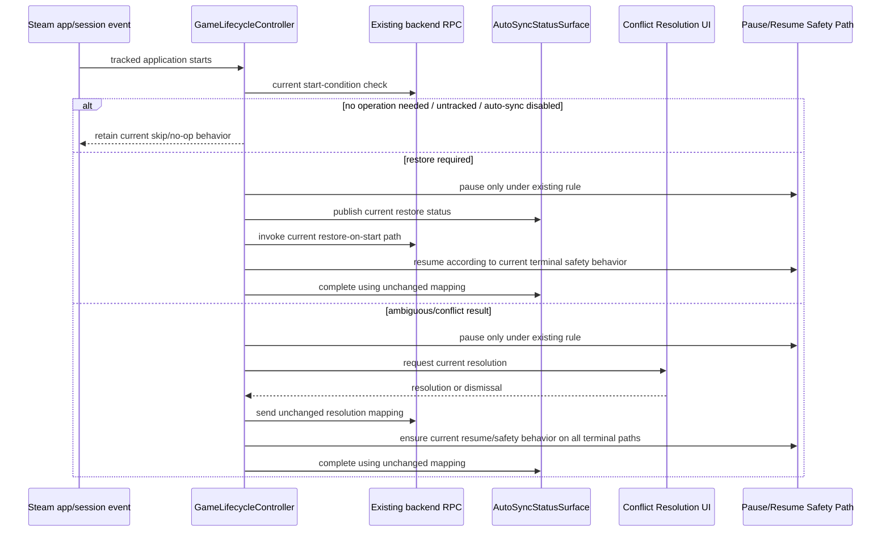
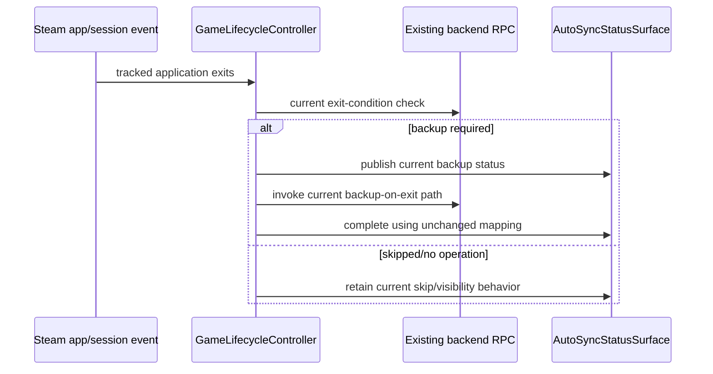

# SDH-Ludusavi v0.2.1 Frontend Decomposition and Composition-Root Refactor
## Phased Implementation Plan for an AI Coding Agent

| Document field | Value |
|---|---|
| Repository | `beallio/SDH-Ludusavi` |
| Plan purpose | Decompose the frontend monolith safely while preserving save, launch-gate, SteamOS UI, and in-plugin updater behavior |
| Stable release baseline | `v0.2.1` |
| Stable release commit | `5a59619` |
| Stable release title | `SDH-Ludusavi v0.2.1: updater post-install state fix` |
| GitHub release timestamp displayed during research | `01 Jun 05:09` |
| Development branch observed during research | `main` visible with HEAD `870f773` (`fix(updater): coerce stale available candidates matching effectiveCurrentVersion after reload`) |
| Primary frontend refactor target at `v0.2.1` | `src/index.tsx` — 2,502 lines / 2,276 LOC / 86.7 KB |
| Existing protected feature boundary | `src/components/PluginUpdateSection.tsx` — 560 lines / 516 LOC / 20.1 KB |
| Risk classification | High: the plugin participates in save restoration, backup, launch gating, process pause/resume, Decky updater handoff, and platform UI resource cleanup |
| Intended reader | An autonomous or semi-autonomous coding agent implementing the refactor under maintainer review |

---

## 1. Executive Directive

Refactor SDH-Ludusavi so that `src/index.tsx` becomes a clear **plugin composition root** rather than the primary owner of presentation, asynchronous settings mutation, SteamOS status-surface handling, and Steam application lifecycle orchestration.

This work shall be implemented as a **behavior-preserving, phased decomposition**. It is not a product redesign. The agent must not alter backup/restore policy, conflict-resolution policy, updater candidate selection, Decky installation handoff, version semantics, or SteamOS-specific style placement merely to simplify file movement.

The stable release baseline is now **`v0.2.1`**, not `v0.1.0` or `v0.2.0`. The plan therefore incorporates the updater correctness behavior shipped in `v0.2.1` as a protected invariant:

- after a successful Decky install handoff, the updater UI must not remain incorrectly stuck on the former “Update available” state;
- the target version is represented optimistically as installed until Decky reload/backend state catches up;
- stale update-check responses must not restore a just-installed update candidate;
- the development-release workflow fix associated with this patch must not be invalidated by unrelated refactor work.

### 1.1 Core decision

**Proceed with modularization.** The refactor is justified because the tagged stable release still contains a very large frontend entry file owning several unrelated, high-impact responsibilities, despite the updater UI already having been extracted into its own substantial component.

### 1.2 Non-negotiable rules

1. The implementing agent must re-check the live repository and current branch at execution time. This plan records a verified baseline; it is not a license to ignore subsequent commits.
2. Read and obey `AGENTS.md` before modifying source.
3. Create or update a plan under `docs/plans/` before implementation.
4. Use the repository wrapper and validation commands required by project instructions.
5. Preserve `v0.2.1` updater behavior and its existing module boundary during initial decomposition phases.
6. Preserve save-integrity behavior, launch gating, process safety, and watchdog expectations.
7. Preserve the SteamOS QAM style-mount strategy: QAM-visible styles remain declaratively rendered in the visible React subtree.
8. Centralize all resource ownership and teardown: timers, BrowserViews/status windows, subscriptions, fallback polling, listeners, and pending mutation behavior require explicit disposal.
9. Do not publish a release, alter stable tags, or trigger deployment unless specifically instructed by the maintainer.

---

## 2. Research Basis and Baseline Update

### 2.1 What changed from the prior plan

A prior draft treated `v0.2.0` as the stable release and a `v0.2.1` development tag as the newest updater line. That is now obsolete.

The live GitHub release page reviewed for this plan marks **`v0.2.1`** as **Latest** and identifies it as a stable patch release from commit `5a59619`. The release notes state that it fixes the updater’s post-install visible state and stale-response behavior, and also corrects the development release workflow.

Accordingly:

| Earlier planning assumption | Updated `v0.2.1` baseline |
|---|---|
| `v0.2.0` is the latest stable release | Superseded: `v0.2.1` is the latest stable release reviewed |
| updater post-install state is still development-only work | Superseded: it is stable-release behavior and a mandatory regression gate |
| extract updater UI as new work | Superseded: `PluginUpdateSection.tsx` already exists and should initially be protected rather than redesigned |
| focus only on original QAM monolith | Updated: decompose remaining root-owned responsibilities while preserving the new updater integration |

### 2.2 Verified stable-release frontend snapshot

The following observations were made from the source at the `v0.2.1` tag:

| Path | Observed content/size | Architectural implication |
|---|---:|---|
| `src/index.tsx` | 2,502 lines / 2,276 LOC / 86.7 KB | Still the primary decomposition target |
| `src/components/PluginUpdateSection.tsx` | 560 lines / 516 LOC / 20.1 KB | Updater view/workflow is already a feature module; preserve its stable behavior |
| `src/components/LogModal.tsx` | Existing component | Some visual extraction already exists |
| `src/state/ludusaviState.tsx` | Existing state module | Use current state ownership before adding new state mechanisms |
| `src/utils/deckyInstaller.ts` | Existing installer adapter | Protect installer handoff boundary during core refactor |
| `src/utils/logging.ts`, `src/utils/steam.ts` | Existing utilities | Reuse current adapter patterns rather than inventing unnecessary frameworks |
| `main.py` | Existing RPC boundary, including updater RPCs | Backend is an integration dependency, not a general refactor target |
| `py_modules/sdh_ludusavi/updater.py` | Existing updater service | Outside principal frontend split scope unless contract preservation requires a minimal fix |

### 2.3 Stable release behavior reported by the project

The `v0.2.1` release notes report these updater changes:

1. Successful Decky installation handoff no longer leaves the UI displaying an obsolete “Update available” state and old install button.
2. The target version is displayed optimistically as installed until plugin/backend reload state catches up.
3. Stale update-check results are prevented from reintroducing the just-installed candidate.
4. The development release workflow no longer fails Python dependency synchronization through `hatch-vcs` when development tags already exist.

The release notes also report validation run during release preparation and GitHub release workflow execution, including Python checks/tests, frontend verification/build, and package ZIP validation. This document does **not** claim those checks were independently rerun during architectural research; the implementing agent must run its own baseline and post-change checks.

### 2.4 Stable release versus current development branch

The stable reference for regression semantics is `v0.2.1` at `5a59619`. During research, the repository’s `main` branch displayed a later visible HEAD, `870f773`, whose commit title also concerns stale available candidates after reload.

The implementing agent shall:

- treat `v0.2.1` behavior as the stable released contract;
- normally implement against the latest intended development branch after synchronizing with origin;
- review every commit after `v0.2.1` that touches `src/index.tsx`, `PluginUpdateSection.tsx`, updater/backend paths, state, lifecycle, or project instructions;
- create a baseline-delta addendum before coding whenever execution HEAD differs from this researched snapshot.

---

## 3. Problem Definition

### 3.1 Current architectural problem

At stable release `v0.2.1`, `src/index.tsx` remains a large mixed-responsibility module. It includes or directly coordinates:

- plugin registration and root lifecycle;
- multiple QAM-visible panels and styling behavior;
- root-owned RPC binding declarations;
- settings persistence and asynchronous sequencing;
- update-channel and automatic-update-check settings supplied to the updater component;
- auto-sync status publication and BrowserView/window lifecycle;
- conflict modal presentation and settlement;
- manual backup and restore actions;
- version/log retrieval;
- Steam application start/exit monitoring;
- restore-before-launch and backup-after-exit orchestration;
- process pause/resume interactions;
- lifetime notification and fallback polling behavior;
- teardown of multiple categories of resources.

`PluginUpdateSection.tsx` has already been separated, which is an appropriate feature boundary, but its integration introduces additional state and mutation dependencies that remain coordinated by the root.

### 3.2 Why a panel-only split is insufficient

Moving JSX sections into individual files improves readability, but does not solve the highest-risk coupling if the following remain in `index.tsx`:

- save-sensitive game lifecycle orchestration;
- process pause/resume safety behavior;
- BrowserView status-surface ownership and timer cleanup;
- ordered settings mutation and stale-write avoidance;
- teardown of background resources.

The required target is therefore not merely “more React components.” It is a separation of:

1. presentation components;
2. shared state and settings mutation control;
3. platform/status-surface services;
4. lifecycle orchestration;
5. RPC/platform adapter boundaries;
6. plugin construction and deterministic teardown.

### 3.3 Desired outcome

After this plan is complete:

- `src/index.tsx` reads as a concise ownership/composition map;
- visible QAM sections are inspectable independently;
- settings sequencing is testable independently;
- status-surface creation/timing/disposal is encapsulated;
- Steam game-lifecycle behavior is encapsulated behind a narrow controller interface;
- updater behavior shipped in `v0.2.1` remains unchanged and explicitly tested;
- the repository has documentation and validation evidence sufficient for maintainer review.

---

## 4. Mandatory Preserved Contracts

The following are not optional design preferences. They are behavior or platform contracts identified from the stable release source and project documentation.

### 4.1 Updater contract introduced or stabilized in `v0.2.1`

`PluginUpdateSection.tsx` currently owns updater workflow calls and post-install UI reconciliation. It includes:

- `installedOverride`;
- an `effectiveCurrentVersion` derived from the installed override or actual current version;
- stale-candidate coercion where an “available” candidate that equals the effective current version is treated as current;
- install candidate revalidation before invoking Decky Installer;
- install handoff success handling, including pending/elapsed-time behavior;
- reconciliation after the real current version catches up.

**Contract:** do not redesign or move these mechanics during the main `index.tsx` decomposition. Root extraction must pass the same props and preserve the same update setting flow. Any later updater-internal refactor requires its own focused plan and tests.

### 4.2 Updater backend and installer handoff contract

The project documentation identifies:

- discovery/validation in `py_modules/sdh_ludusavi/updater.py`;
- stable and development channel version-selection behavior;
- persistent settings `update_channel` and `automatic_update_checks`;
- cache metadata such as `last_checked_at` and `pending_update_install`;
- pre-install `revalidate_plugin_update(candidate)`;
- `src/utils/deckyInstaller.ts` as the adapter isolating `window.DeckyBackend`;
- Decky handoff using update or downgrade installation type after recording the install request.

**Contract:** the frontend decomposition must not alter candidate-selection rules, artifact validation, installer invocation, or backend persistence without a separately approved behavior change.

### 4.3 SteamOS multi-window QAM styling contract

The project documentation records that the Quick Access Menu overlay and background plugin-loader context use isolated CEF `document` instances. Appending a stylesheet to `document.head` during `definePlugin` initialization does not reliably style visible QAM components. Styles required in QAM must be rendered directly in the visible React JSX tree.

**Contract:** if QAM styles are extracted, they must remain rendered as visible JSX, for example through a `QamStyles` component rendered inside `LudusaviContent`. Do not move QAM styling into root initialization only.

### 4.4 QAM cache marker limitation contract

The project documents its `O(1)` status cache marker approach and explicitly states that direct external changes inside backup folders, for example through Dropbox, Syncthing, or manual operations, will not immediately update cached QAM status until a Ludusavi operation or manual refresh occurs.

**Contract:** a refactor shall not inadvertently claim, imply, or implement different external-change detection behavior unless separately specified and tested.

### 4.5 Save operation and lifecycle contract

Technical operation values and skip reasons are part of current behavior, including successful backup/restore results and skip/failure/conflict-related outcomes. The lifecycle code participates in launch gating and may pause/resume game processes.

**Contract:** no extraction shall change which operation is performed, when a conflict is requested, how terminal outcomes are mapped, or how paused processes are safely resumed.

---

## 5. Agent Operating Protocol

The repository includes agent-specific instructions. The implementing agent shall follow them as mandatory workflow gates.

### 5.1 Before any modification: read-only verification

Run at the project root:

```bash
pwd
ls -la
git status --short --branch
git remote -v
git fetch --tags origin
git branch --show-current
git rev-parse HEAD
git log --oneline --decorate -25
git tag --points-at HEAD
git describe --tags --always --dirty
```

Read the governing documents and enumerate existing plans:

```bash
sed -n '1,620p' AGENTS.md
sed -n '1,520p' DEVELOPMENT.md
find docs/specs -maxdepth 1 -type f -print 2>/dev/null | sort
find docs/plans -maxdepth 1 -type f -print 2>/dev/null | sort
find docs/agent_conversations -maxdepth 1 -type f -print 2>/dev/null | sort
```

Read any current plans or session notes relating to:

- updater implementation;
- updater installer handoff;
- updater logging/timing/post-install reconciliation;
- game lifecycle or watchdog;
- frontend/QAM structure.

### 5.2 Required protocol handshake

After read-only verification, output the repository-required `AGENT_PROTOCOL_HANDSHAKE`, including at minimum:

- confirmed project root;
- detected languages/tooling;
- execution mode (`Project Mode`);
- Git repository presence, branch and exact SHA;
- required cache root;
- wrapper command (`./run.sh`);
- confirmations for no user-work overwrite, plan-first workflow, validation and atomic commits.

If any required fact cannot be determined, stop source modification and resolve the discrepancy first.

### 5.3 Execution-baseline delta addendum

The researched reference points for this plan are:

```text
Stable release: v0.2.1 / 5a59619
Observed main during research: 870f773
```

Before implementation, compare actual HEAD and stable tags:

```bash
git fetch --tags origin
git log --oneline --decorate --graph --all -30
git diff --stat v0.2.1..HEAD -- src main.py py_modules tests docs package.json plugin.json
git diff --name-status v0.2.1..HEAD -- src main.py py_modules tests docs package.json plugin.json
```

Create or update a local plan in `docs/plans/`, and include a **Baseline Delta Addendum** with:

| Field | Required content |
|---|---|
| Actual implementation SHA | Full SHA and branch |
| Stable release/tag confirmed | Current latest stable release and tag reference |
| Changes after `v0.2.1` affecting scope | File list and functional interpretation |
| New or revised invariants | Especially updater, lifecycle, state, styling, tests or instructions |
| Phase changes required | State exactly which phases or acceptance criteria change |
| Uncommitted work present | Paths and how they were protected |

### 5.3.1 Baseline Delta Addendum - 2026-06-01 execution

| Field | Execution baseline |
|---|---|
| Actual implementation branch | `refactor/frontend-index-decomposition` |
| Actual implementation SHA | `5a596194432407e8b2acc7a9a43202e7542bf589` |
| Stable release/tag confirmed | `v0.2.1` points at `5a596194432407e8b2acc7a9a43202e7542bf589`; `git describe --tags --always --dirty` returned `v0.2.1` before source edits |
| Remote/tag refresh | `git fetch --tags origin` completed and added `v0.2.1-dev.ge12c7aa`; `origin/main` and `origin/HEAD` point at `5a59619` |
| Changes after `v0.2.1` affecting scope | None in the active implementation baseline. `git diff --stat v0.2.1..HEAD -- src main.py py_modules tests docs package.json plugin.json` and `git diff --name-status v0.2.1..HEAD -- src main.py py_modules tests docs package.json plugin.json` returned no tracked changes |
| User-owned worktree state | Before branching, the only uncommitted path was the untracked plan file `docs/plans/2026-05-31_v0.2.1_Frontend_Decomposition_Implementation_Plan.md`; it is treated as maintainer-provided input and preserved |
| Current file metrics | `src/index.tsx`: 2,502 lines; `src/components/PluginUpdateSection.tsx`: 560 lines; `src/utils/deckyInstaller.ts`: 60 lines; `main.py`: 519 lines; `py_modules/sdh_ludusavi/updater.py`: 807 lines |
| Root-owned RPC declarations confirmed | `get_settings`, `get_game_history`, `set_auto_sync_enabled`, `set_notification_settings`, `set_selected_game`, `refresh_games`, `is_game_cache_current`, `force_backup`, `force_restore`, `get_versions`, `get_operation_status`, `get_recent_logs`, `get_ludusavi_logs`, `set_update_channel`, `set_automatic_update_checks`, `get_ludusavi_command`, `pause_game_process`, `resume_game_process`, `check_game_start`, `restore_game_on_start`, `resolve_game_start_conflict`, `check_game_exit`, `backup_game_on_exit` |
| Protected updater boundary confirmed | `PluginUpdateSection.tsx` still owns `check_for_plugin_update`, `revalidate_plugin_update`, `record_update_install_requested`, `installedOverride`, `effectiveCurrentVersion`, and stale available-candidate coercion; the decomposition must keep this module's internal state machine intact |
| New or revised invariants | No new runtime invariants were discovered. Existing protected invariants remain: QAM styles must be visible-tree JSX, updater props must preserve `v0.2.1` installed-override behavior, settings mutations must keep later-intent-wins semantics, BrowserView/status timers must dispose idempotently, and lifecycle extraction must preserve launch gating and pause/resume safety |
| Phase changes required | No phase order changes. Because this checkout is exactly the stable tag, Phase 1 characterization can target the current `v0.2.1` source directly; later phases should update existing static tests as code moves so tests assert ownership by the new modules instead of by `src/index.tsx` text positions |

### 5.4 Worktree safety

If the worktree contains existing uncommitted changes:

- do not overwrite, reformat, stage, revert, or absorb them;
- identify overlap with planned source files;
- limit work to non-overlapping changes or await maintainer direction where conflict is unavoidable;
- record the condition in the plan and final handoff.

### 5.5 Required development workflow

Follow the project-prescribed sequence:

```text
ANALYZE → PLAN → TEST (RED where behavior is being changed/protected)
→ IMPLEMENT (GREEN) → REFACTOR → VALIDATE → COMMIT → DOCUMENT
```

For behavior-preserving movement, characterization tests and validation are still required because side-effect ownership can change observably even when product intent does not.

### 5.6 Branch and commit discipline

Create a feature branch after baseline verification and only when no conflicting worktree state prevents it. Use a name consistent with project conventions, for example:

```bash
git switch -c refactor/frontend-index-decomposition
```

Use atomic Conventional Commit messages, such as:

```text
docs(plan): establish v0.2.1 frontend decomposition baseline
test(frontend): characterize root-owned updater and lifecycle boundaries
refactor(frontend): extract pure operation formatting helpers
refactor(frontend): extract root rpc facade
refactor(qam): extract visible menu sections
refactor(settings): isolate ordered settings mutation controller
refactor(status): isolate auto-sync status surface
refactor(lifecycle): isolate Steam game session controller
docs(frontend): record v0.2.1 regression validation
```

Do not combine large lifecycle extraction, updater redesign, and UI movement in a single commit.

---

## 6. Current Responsibility Map

The agent must regenerate an exact map from its checked-out code. The following map reflects the tagged `v0.2.1` source reviewed for this plan.



### 6.1 Current responsibility evidence checklist

Before implementation, locate and document all relevant declarations in the actual execution baseline. At `v0.2.1`, the reviewed source includes:

| Responsibility category | Examples observed in stable source |
|---|---|
| Root-owned RPC declarations | settings, game history, auto-sync, notification settings, selected game, refresh/cache, backup, restore, versions, operation status, logs, update-channel preferences, Ludusavi command, process pause/resume, lifecycle checks/resolution/backup |
| Formatting | last-operation text, time/date formatting, conflict formatting |
| Status surface | BrowserView acquisition/normalization, publication, hide/complete, timer and destruction behavior |
| Conflict UI | conflict modal component and promise-based modal settlement |
| Settings sequencing | queue processing, enqueue logic, timeout behavior, sequence counters including updater preference sequences |
| Lifecycle | start/exit checking, restore/backup flows, process handling, subscriptions/polling |
| Updater feature boundary | update check, context, candidate revalidation, record-install request, installer handoff, installed override, stale-response reconciliation |

---

## 7. Target Architecture

### 7.1 Design objectives

The target design shall:

- leave `index.tsx` as the owner of plugin construction and orderly disposal;
- keep each unique shared state concern with one explicit owner;
- render visible UI through controlled feature components;
- isolate side-effect-heavy services behind small interfaces;
- preserve the existing updater feature boundary until a separate updater-focused effort is justified;
- introduce the fewest new abstractions necessary to clarify ownership and test behavior.

### 7.2 Proposed target tree

Adapt names to established repository conventions discovered at implementation time. Do not relocate already-stable files solely for aesthetic uniformity.

```text
src/
  index.tsx                                  # Thin definePlugin composition root and teardown

  api/
    ludusaviRpc.ts                           # Typed facade for root-owned RPC bindings

  components/
    LogModal.tsx                             # Existing; retain initially
    PluginUpdateSection.tsx                  # Existing; protected through core refactor

    modals/
      ConflictResolutionModal.tsx            # View-only extraction

    qam/
      LudusaviContent.tsx                    # Visible QAM component composition
      QamStyles.tsx                          # Style JSX mounted inside visible QAM tree
      GameSelectionSection.tsx
      OperationStatusSection.tsx
      ManualOperationsSection.tsx
      AutoSyncSettingsSection.tsx
      LudusaviLauncherSection.tsx
      VersionAndLogsSection.tsx

  controllers/
    settingsMutationController.ts            # Ordered settings persistence and disposal
    gameLifecycleController.ts               # Steam start/exit/session orchestration

  surfaces/
    autoSyncStatusSurface.ts                 # BrowserView/status timers/hide/destroy ownership

  formatting/
    dateTime.ts                              # Pure date/time formatting
    operationText.ts                         # Pure operation/status display mapping

  state/
    ludusaviState.tsx                        # Existing shared state; preserve single ownership

  utils/
    deckyInstaller.ts                        # Existing updater installer boundary; protect initially
    logging.ts                               # Existing
    steam.ts                                 # Existing
```

### 7.3 Target dependency direction



### 7.4 Target `index.tsx` ownership

The final root should be understandable as a lifetime graph. The exact API below is illustrative and must be adapted to the code actually present during implementation:

```tsx
export default definePlugin(() => {
  const store = createLudusaviStateStore();
  const rpc = createLudusaviRpc();
  const statusSurface = createAutoSyncStatusSurface({ log });
  const settingsMutations = createSettingsMutationController({ store, rpc, log });
  const lifecycle = createGameLifecycleController({
    store,
    rpc,
    statusSurface,
    resolveConflict: openConflictResolutionModal,
    log,
  });

  lifecycle.start();

  return {
    name: "SDH-Ludusavi",
    content: (
      <LudusaviStateProvider store={store}>
        <LudusaviContent
          rpc={rpc}
          settingsMutations={settingsMutations}
        />
      </LudusaviStateProvider>
    ),
    icon: <PluginIcon />,
    alwaysRender: true,
    onDismount() {
      lifecycle.dispose();
      settingsMutations.dispose();
      statusSurface.dispose();
      store.dispose?.();
    },
  };
});
```

**Important:** this is an ownership example, not a command to invent APIs unsupported by the current repository. The agent shall first identify the current store, state hooks and existing teardown functions.

---

## 8. Interface Guidance

Only introduce interfaces that create a useful seam for testing or resource ownership.

### 8.1 Root-owned RPC facade

The root currently declares many RPC functions. Extract those it owns into a typed facade. Leave component-local updater workflow RPC declarations in `PluginUpdateSection.tsx` during early phases.

Illustrative shape:

```ts
export interface LudusaviRpc {
  getSettings(): Promise<RpcResult<Settings>>;
  getGameHistory(): Promise<RpcResult<GameHistory>>;
  setAutoSyncEnabled(enabled: boolean): Promise<RpcResult<Settings>>;
  setNotificationSettings(settings: NotificationSettings): Promise<RpcResult<Settings>>;
  setSelectedGame(gameName: string): Promise<RpcResult<Settings>>;
  refreshGames(): Promise<RpcResult<RefreshResult>>;
  isGameCacheCurrent(): Promise<RpcResult<boolean>>;
  forceBackup(gameName: string): Promise<RpcResult<OperationResult>>;
  forceRestore(gameName: string): Promise<RpcResult<OperationResult>>;
  getVersions(): Promise<RpcResult<Versions>>;
  getOperationStatus(): Promise<OperationStatus>;
  getRecentLogs(): Promise<LogEntry[]>;
  getLudusaviLogs(): Promise<LogEntry[]>;
  setUpdateChannel(channel: UpdateChannel): Promise<RpcResult<Settings>>;
  setAutomaticUpdateChecks(enabled: boolean): Promise<RpcResult<Settings>>;
  getLudusaviCommand(): Promise<RpcResult<LudusaviCommand>>;
  pauseGameProcess(appId: number): Promise<RpcResult<unknown>>;
  resumeGameProcess(appId: number): Promise<RpcResult<unknown>>;
  checkGameStart(appId: number): Promise<RpcResult<LifecycleCheck>>;
  restoreGameOnStart(input: RestoreStartInput): Promise<RpcResult<OperationResult>>;
  resolveGameStartConflict(input: ConflictResolutionInput): Promise<RpcResult<OperationResult>>;
  checkGameExit(appId: number): Promise<RpcResult<LifecycleCheck>>;
  backupGameOnExit(input: BackupExitInput): Promise<RpcResult<OperationResult>>;
}
```

Map this to existing type definitions. Do not silently alter backend method strings, argument order, return shapes or error handling.

### 8.2 Settings mutation controller

The root contains asynchronous settings queue behavior and sequence counters, including update preference sequences. Encapsulate ordering and disposal.

Illustrative shape:

```ts
export interface SettingsMutationController {
  setAutoSyncEnabled(enabled: boolean): Promise<void>;
  setNotificationSettings(settings: NotificationSettings): Promise<void>;
  setSelectedGame(gameName: string): Promise<void>;
  setUpdateChannel(channel: UpdateChannel): Promise<void>;
  setAutomaticUpdateChecks(enabled: boolean): Promise<void>;
  isPending(key?: SettingsMutationKey): boolean;
  subscribe(listener: () => void): () => void;
  dispose(): void;
}
```

Required invariants:

| Invariant | Requirement |
|---|---|
| Later intent wins | An older asynchronous completion cannot overwrite a later setting choice |
| Pending-state integrity | Pending state settles or is cleared on disposal; controls do not remain indefinitely busy |
| Updater-prop integrity | `PluginUpdateSection` receives current update-channel and automatic-check settings consistently |
| Error behavior preservation | Existing rollback/refresh/error notification semantics remain unchanged |
| Disposal safety | No controller state update after root disposal |

### 8.3 Automatic-sync status surface

Extract BrowserView/window and timer ownership behind one explicit resource owner.

Illustrative shape:

```ts
export interface AutoSyncStatusSurface {
  publish(status: AutoSyncStatus, context: AutoSyncContext): void;
  complete(result: OperationResult | LifecycleCheck, context: AutoSyncContext): void;
  hide(reason?: string): void;
  dispose(): void;
}
```

Required invariants:

- no more than one owned visible status surface per plugin lifetime;
- superseded timers cannot hide newer statuses;
- cleanup is idempotent;
- unload/reload cannot retain an orphan status window;
- text/status mapping remains behavior-identical during extraction.

### 8.4 Game lifecycle controller

The highest-risk behavior should have a small externally visible lifecycle:

```ts
export interface GameLifecycleController {
  start(): void;
  dispose(): void;
}
```

It may accept dependencies for the RPC boundary, status surface, state, logging, notifications, modal resolution and Steam session adapter. It must not make individual QAM leaf components responsible for background operations.

---

## 9. Phased Roadmap



| Phase | Main objective | Risk level | Behavioral redesign allowed? | Principal regression focus |
|---:|---|---:|---|---|
| 0 | Confirm live baseline and comply with repository process | Low | No | Correct branch/release/instructions |
| 1 | Capture current contracts before movement | Medium | Tests/documentation only | Updater, lifecycle, teardown, settings ordering |
| 2 | Extract pure helpers | Low | No | Strings and formatting unchanged |
| 3 | Extract root RPC facade | Medium | No | Method names/signatures/timing unchanged |
| 4 | Extract controlled view sections | Medium | No | QAM rendering and visible JSX styles |
| 5 | Extract settings mutation control | High | No intended change | stale writes and updater preference propagation |
| 6 | Extract status surface | High | No intended change | BrowserView/timers/disposal/status mapping |
| 7 | Extract game lifecycle orchestration | Critical | No intended change | saves, launch gate, pause/resume, subscriptions |
| 8 | Finalize root and audit updater integration | High | No | `v0.2.1` post-install state contract |
| 9 | Validate and document | High validation burden | No release unless ordered | automated and device/runtime evidence |

---

# 10. Phase 0 — Synchronize, Establish the Baseline, and Record the Plan

## 10.1 Objective

Ensure the AI agent works against the repository as it exists at execution time and understands all project-local rules before making source edits.

## 10.2 Tasks

1. Perform the read-only verification and handshake in Section 5.
2. Confirm whether `v0.2.1` remains the latest stable release and whether `main` has advanced.
3. Inspect current file metrics and high-impact symbols:

   ```bash
   wc -l src/index.tsx src/components/PluginUpdateSection.tsx src/utils/deckyInstaller.ts
   wc -l main.py py_modules/sdh_ludusavi/updater.py
   rg -n "PluginUpdateSection|installedOverride|effectiveCurrentVersion|set_update_channel|set_automatic_update_checks|check_for_plugin_update|revalidate_plugin_update|record_update_install_requested" src main.py py_modules tests
   rg -n "BrowserView|publishAutoSyncStatus|hideAutoSyncStatus|completeAutoSyncStatus|destroyAutoSyncStatus|ConflictResolution|pause_game_process|resume_game_process|check_game_start|restore_game_on_start|check_game_exit|backup_game_on_exit|onDismount|RegisterFor|poll" src main.py py_modules tests
   ```

4. Create the active implementation-plan file in `docs/plans/`, incorporating the baseline delta.
5. Review all changed files since stable release and determine whether this plan requires amendment.
6. Create a feature branch only after confirming no conflicting uncommitted work.

## 10.3 Deliverables

- `AGENT_PROTOCOL_HANDSHAKE`.
- `docs/plans/<date>_frontend_index_decomposition_v0.2.1.md`.
- Baseline Delta Addendum.
- Exact source responsibility map and current validation command list.

## 10.4 Acceptance criteria

- No product source modifications made before plan record.
- Any execution-time differences from `v0.2.1`/researched `main` are documented.
- Existing updater reliability work is identified and protected.

## 10.5 Recommended commit

```text
docs(plan): establish v0.2.1 frontend decomposition baseline
```

---

# 11. Phase 1 — Contract Inventory and Characterization Protection

## 11.1 Objective

Write down and, where possible, automate protection for the current behavior before moving side-effecting code.

## 11.2 Why this must precede extraction

Compilation proves types, not runtime correctness. The critical risks are behavioral:

- a restore is skipped or duplicated;
- a game remains paused;
- an old status timer hides a newer update;
- settings settle in the wrong order;
- a successful update installation is shown as available again;
- a reload registers duplicate listeners.

## 11.3 Contract matrix to complete from actual execution source

| Area | Current owner(s) | Observable contract | Protection method before extraction |
|---|---|---|---|
| Plugin root lifecycle | `src/index.tsx` | plugin content renders; always-render/background behavior remains; teardown removes all resources | static/build plus manual load/unload/reload checks |
| Updater stable patch behavior | `PluginUpdateSection.tsx`, `deckyInstaller.ts`, updater RPC/backend | installed override, stale-candidate suppression, revalidation and handoff remain | preserve module; existing backend tests; explicit manual/UI regression matrix |
| Settings queue | `src/index.tsx` | later user intent wins; updater settings reach component; failures/pending settle | unit/static characterization where feasible; manual rapid-toggle checks |
| QAM style mount | `src/index.tsx`/visible component tree | visible QAM controls styled within isolated CEF context | source invariant plus Steam Deck visual validation |
| Status surface | `src/index.tsx` | publication/terminal mappings/timers/destruction unchanged | transition table and unload/reload verification |
| Conflict UI | `src/index.tsx` | same choices/dismissal and same resolution call mapping | view extraction only after mapping table completed |
| Start lifecycle | `src/index.tsx`, RPC/backend | restore/conflict/skip behavior and process safety unchanged | lifecycle test matrix and watchdog gates |
| Exit lifecycle | `src/index.tsx`, RPC/backend | backup-on-exit behavior unchanged | lifecycle test matrix |
| Cache limitations | backend/QAM status path | external backup-folder edits require operation/refresh as documented | documentation and manual check, not redesigned |

## 11.4 Baseline automated validation

Check actual project instructions in `AGENTS.md` and `DEVELOPMENT.md`, then run the established baseline suite. At the reviewed `v0.2.1` documentation/package configuration, the expected command set is:

```bash
./run.sh uv run ruff check . --fix
./run.sh uv run ruff format .
./run.sh uv run ty check py_modules/sdh_ludusavi/
./run.sh uv run pytest
pnpm run typecheck
pnpm run verify
pnpm run build
```

The agent shall record:

- exact commands;
- pass/fail result;
- any pre-existing failure before refactor;
- relevant output or logs;
- Node/pnpm/uv versions where reproducibility matters.

## 11.5 Testing policy

The reviewed project uses Python tests and frontend typecheck/build/supply-chain validation. Before adding a TypeScript runtime-test framework, determine whether one already exists in the current branch. Do not expand tooling casually.

Preferred sequence:

1. extend existing Python/static contract tests where they already check frontend structure or build/package contracts;
2. keep early extractions pure and mechanically reviewable;
3. add minimal targeted test infrastructure only when it is essential to make settings/status/lifecycle behavior verifiable and conforms to project policy;
4. require Steam Deck/Decky runtime validation for platform-specific behavior regardless of unit coverage.

## 11.6 Acceptance criteria

- An explicit behavior inventory exists.
- The pre-change automated suite is recorded.
- Any missing test seam needed for high-risk extraction is either added or clearly addressed through controlled validation.
- Updater, watchdog/process safety, and QAM style constraints are marked as blocking gates.

## 11.7 Recommended commit

```text
test(frontend): characterize v0.2.1 decomposition boundaries
```

---

# 12. Phase 2 — Extract Pure Formatting and Display Mapping

## 12.1 Objective

Remove side-effect-free helper logic from `src/index.tsx` first, establishing module conventions with minimal behavioral risk.

## 12.2 Candidate logic

The stable source contains helpers such as:

- last-operation display text mapping;
- time and date formatting;
- conflict time formatting;
- other pure mapping functions confirmed during execution review.

Proposed files:

```text
src/formatting/dateTime.ts
src/formatting/operationText.ts
```

## 12.3 Rules

Move only functions that:

- do not invoke RPCs;
- do not mutate global or React state;
- do not create timers or platform UI;
- do not log as part of operation state;
- do not open modals;
- do not decide lifecycle actions.

## 12.4 Example extraction

```ts
// src/formatting/dateTime.ts
export function formatConflictTime(value?: string | null): string {
  if (!value) {
    return "Unknown time";
  }

  const parsed = new Date(value);
  if (Number.isNaN(parsed.getTime())) {
    return value;
  }

  return parsed.toLocaleString();
}
```

Use the current function body and current strings exactly. The example above is illustrative; the implementation must copy actual stable/development behavior rather than rewrite it from memory.

## 12.5 Tasks

1. Identify pure helper definitions and all call sites.
2. Record before/after exports in the plan.
3. Move one cohesive helper group per small commit if needed.
4. Run frontend typecheck/build/verify and full required automated suite.
5. Review generated bundle/package changes according to repository conventions.

## 12.6 Acceptance criteria

- No user-visible wording, result mapping, date fallback, locale behavior or status semantics changed.
- No side-effecting logic was moved under the label of formatting.
- Source diff is mechanical and reviewable.

## 12.7 Rollback criterion

If any status text or operation mapping cannot be shown to be pure, leave it in place until its owning service phase.

## 12.8 Recommended commit

```text
refactor(frontend): extract pure display formatting helpers
```

---

# 13. Phase 3 — Extract a Typed Facade for Root-Owned RPC Bindings

## 13.1 Objective

Make the backend boundary explicit and remove bulk RPC declaration noise from the root without changing invocation semantics.

## 13.2 Critical separation

The updater component already owns its workflow RPCs:

- `check_for_plugin_update`;
- `revalidate_plugin_update`;
- `record_update_install_requested`;
- `get_update_check_context`.

Leave those declarations and their install/reconcile flow in `PluginUpdateSection.tsx` during this phase.

Root-level settings that feed updater props, such as `set_update_channel` and `set_automatic_update_checks`, may be included in the root-owned facade if moved mechanically and kept behavior-identical.

## 13.3 Tasks

1. Inventory all `callable(...)` declarations currently in `src/index.tsx`.
2. Produce a mapping table:

   | RPC backend method | Existing owner | New facade method | Used by | Moved in this phase? | Justification |
   |---|---|---|---|---|---|

3. Create `src/api/ludusaviRpc.ts` with identical backend method strings, parameter orderings and return types.
4. Replace root usage with facade imports.
5. Do not combine this with action-timing, retry, timeout or error-message changes.
6. Verify no duplicate wrapper remains without deliberate reason.

## 13.4 Example boundary rule

```text
Root QAM and lifecycle RPC definitions → eligible for src/api/ludusaviRpc.ts.
PluginUpdateSection update-check/revalidate/install-record RPC definitions → retain in PluginUpdateSection.tsx.
deckyInstaller adapter → retain in src/utils/deckyInstaller.ts.
updater.py / main.py method behavior → do not refactor as part of this phase.
```

## 13.5 Acceptance criteria

- Every moved RPC invokes exactly the same backend method with the same payload.
- Error handling and invocation timing are unchanged.
- `PluginUpdateSection` remains functionally unchanged.
- Backend updater/watchdog tests and frontend validation pass.

## 13.6 Rollback criterion

If facade extraction requires a signature redesign to compile, stop and determine whether source has changed or the proposed grouping is incorrect. Do not force contract changes into a structural commit.

## 13.7 Recommended commit

```text
refactor(frontend): extract root-owned rpc facade
```

---

# 14. Phase 4 — Extract Controlled QAM View Components

## 14.1 Objective

Move visible UI composition out of the plugin entry module while retaining state/effect ownership above or behind the views.

## 14.2 Extraction order

Proceed from least coupled visual concerns to more connected views:

1. `VersionAndLogsSection`
2. `ManualOperationsSection`
3. `GameSelectionSection`
4. `AutoSyncSettingsSection`
5. `LudusaviLauncherSection`
6. `ConflictResolutionModal`
7. `QamStyles`
8. `LudusaviContent` composition wrapper

Continue rendering the existing `PluginUpdateSection` through its current stable props.

## 14.3 Controlled component principle

Views receive data and callbacks. They do not independently become sources of truth or background side-effect owners.

Illustrative props:

```ts
export interface AutoSyncSettingsSectionProps {
  autoSyncEnabled: boolean;
  notificationsEnabled: boolean;
  updateChannel: UpdateChannel;
  automaticUpdateChecks: boolean;
  pendingKeys: ReadonlySet<string>;
  onAutoSyncChange(enabled: boolean): void;
  onNotificationsChange(enabled: boolean): void;
  onUpdateChannelChange(channel: UpdateChannel): void;
  onAutomaticUpdateChecksChange(enabled: boolean): void;
}
```

The section must not create RPC bindings, maintain a competing persistent-settings copy, open BrowserViews, or register Steam session listeners.

## 14.4 Stable updater rendering boundary

Render `PluginUpdateSection` from the new content composition using equivalent props. Preserve at minimum:

- current version value propagation;
- update channel value and mutation callback;
- automatic-update-check value and mutation callback;
- whatever notification/logging hooks or environment props are currently passed;
- component mount/unmount behavior unless explicitly verified harmless.

Do not duplicate `installedOverride` or `effectiveCurrentVersion` into a parent.

## 14.5 Conflict modal extraction

Extract only presentation and direct choice callbacks:

```ts
type ConflictResolutionModalProps = {
  conflict: LifecycleCheckResult;
  onChoose: (resolution: ConflictResolution) => void;
  onDismiss: () => void;
  closeModal?: () => void;
};
```

Retain lifecycle decision orchestration and backend interaction in the current controller/caller until the lifecycle phase.

## 14.6 QAM stylesheet requirement

Create a visible-tree component only if it preserves current behavior:

```tsx
export function QamStyles() {
  return <style>{qamStyles}</style>;
}

export function LudusaviContent(props: LudusaviContentProps) {
  return (
    <>
      <QamStyles />
      {/* Extracted visual sections and existing PluginUpdateSection */}
    </>
  );
}
```

The stylesheet must not be moved solely to plugin initialization or a background document.

## 14.7 Acceptance criteria

- QAM controls render and behave as before.
- Visible QAM styling remains functional on SteamOS/Decky runtime.
- `PluginUpdateSection` behavior is unaffected.
- Extracted panels contain no long-lived lifecycle/resource ownership.
- Shared state remains singular and deliberate.
- Validation commands and visual smoke checks pass.

## 14.8 Rollback criterion

If CSS styling differs on-device despite compilation, restore the visible JSX mounting strategy immediately before any further extraction.

## 14.9 Recommended commits

```text
refactor(qam): extract controlled menu sections
refactor(qam): extract visible style and content composition
refactor(qam): extract conflict modal view
```

Keep these atomic if the diff becomes large.

---

# 15. Phase 5 — Extract the Ordered Settings Mutation Controller

## 15.1 Objective

Isolate asynchronous persistence, sequencing and pending-state behavior for settings, including updater preferences.

## 15.2 Why this phase matters after `v0.2.1`

The updater section consumes root-managed persistent preferences such as update channel and automatic update checks. A refactor that introduces stale setting results can make updater behavior appear wrong even if the updater’s internal post-install fix remains intact.

The stable source includes settings queue processing, timeout behavior and sequence counters, including counters for update-channel and automatic-update-check mutations. That is a separate concurrency responsibility from rendering.

## 15.3 Proposed owner

```text
src/controllers/settingsMutationController.ts
```

## 15.4 Required invariants

| Scenario | Required result |
|---|---|
| A single setting mutation succeeds | authoritative/persisted UI state settles exactly as before |
| Same toggle is changed rapidly | later user intent wins regardless of earlier promise settlement timing |
| Mutation fails | existing rollback/refresh/error notification strategy remains unchanged |
| Update channel changes | existing `PluginUpdateSection` receives consistent new preference |
| Automatic update checks change | existing `PluginUpdateSection` receives consistent new preference |
| Plugin unmounts during mutation | no state update on disposed owner; pending state cannot remain orphaned |
| QAM reopens after mutation | display state is loaded/reconciled through the existing authoritative path |

## 15.5 Suggested design pattern

Adapt to actual existing queue semantics. A revision-key mechanism is appropriate only if it reflects current behavior:

```ts
class SettingsMutationControllerImpl implements SettingsMutationController {
  private disposed = false;
  private revision = new Map<SettingsMutationKey, number>();
  private pending = new Set<SettingsMutationKey>();

  async persist<T>(
    key: SettingsMutationKey,
    action: () => Promise<RpcResult<Settings>>
  ): Promise<void> {
    const current = (this.revision.get(key) ?? 0) + 1;
    this.revision.set(key, current);
    this.pending.add(key);
    this.emit();

    try {
      const response = await action();
      if (this.disposed || this.revision.get(key) !== current) {
        return;
      }
      this.applyAccordingToCurrentContract(response);
    } finally {
      if (!this.disposed && this.revision.get(key) === current) {
        this.pending.delete(key);
        this.emit();
      }
    }
  }

  dispose(): void {
    this.disposed = true;
    this.pending.clear();
    this.listeners.clear();
  }
}
```

Do not alter optimistic/pessimistic state behavior without a behavior-change specification and failing test first.

## 15.6 Tasks

1. Fully document current queue inputs, sequence counters, timeouts and error paths.
2. Create characterization tests or controlled test seam appropriate for existing tooling.
3. Extract the queue/controller with the same inputs and observable results.
4. Adapt `LudusaviContent` or root hooks to consume controller state/actions.
5. Verify `PluginUpdateSection` preference propagation and rapid toggles.

## 15.7 Acceptance criteria

- One explicit controller owns mutation ordering.
- Leaf UI components render state and call actions only.
- Updater preference changes remain correct.
- No stale response can revert newer root-level setting intent.
- Disposal is explicit and idempotent.

## 15.8 Rollback criterion

Any discrepancy in updater setting display, persistent preferences, pending indicators or error behavior blocks progression to status/lifecycle extraction.

## 15.9 Recommended commit

```text
refactor(settings): isolate ordered settings mutation controller
```

---

# 16. Phase 6 — Extract the Automatic-Sync Status Surface

## 16.1 Objective

Move imperative status BrowserView/window/timer logic into a single disposable service.

## 16.2 Existing concern

The stable source includes functions for:

- obtaining/creating a BrowserView using available Steam/Decky paths;
- normalizing/positioning/configuring the status view;
- publishing auto-sync statuses;
- completing and hiding statuses;
- tracking timers;
- destroying the BrowserView and fallback owner resources;
- mapping operation results to presentation state.

This is platform resource management, not ordinary React view composition.

## 16.3 Proposed owner

```text
src/surfaces/autoSyncStatusSurface.ts
```

## 16.4 Required status transition inventory

Before moving code, populate this table from the actual current source, retaining exact strings/status values/timeouts:

| Input operation/outcome | Current surface state/text | Timer or terminal behavior | Preservation requirement |
|---|---|---|---|
| Restore started | Record from source | Record from source | Exact during extraction |
| Backup started | Record from source | Record from source | Exact during extraction |
| `backed_up` | `has_backup` mapping observed | Record timing | Preserve |
| `restored` | `has_backup` mapping observed | Record timing | Preserve |
| `failed` | `error` mapping observed | Record timing | Preserve |
| conflict-related outcome | `conflict` mapping observed | Record timing/modal interaction | Preserve |
| skipped `local_current` | `has_backup` mapping observed | Record timing | Preserve |
| skipped `ambiguous_recency`, `game_error`, `preview_failed` | `error` mapping observed | Record timing | Preserve |
| timeout/failure path | Record from source | Record destruction/hide behavior | Preserve |
| plugin unload | hidden/destroyed/cleared | Immediate disposal | Preserve |

## 16.5 Service behavior constraints

- Own all surface-related timers.
- Increment a revision/generation token or preserve the current equivalent to prevent old timers changing newer output.
- Make `dispose()` idempotent.
- Do not place QAM content styling in this service.
- Do not move save-decision logic into this service.
- Use existing logging behavior unless a separate observability change is approved.

## 16.6 Example interface

```ts
export interface AutoSyncStatusSurface {
  publish(status: AutoSyncStatus, context: AutoSyncContext): void;
  complete(result: OperationResult | LifecycleCheckResult, context: AutoSyncContext): void;
  hide(reason?: string): void;
  dispose(): void;
}
```

## 16.7 Tests and manual validation

Validate:

- repeated sequential status publications;
- completion after restore and backup;
- failure and conflict presentation;
- superseded timer not hiding a newer status;
- hide/destroy during plugin unload;
- plugin reload after visible status;
- exactly one surface/resource after reload.

## 16.8 Acceptance criteria

- Root no longer directly implements BrowserView/timer ownership.
- Status mapping and visible behavior are unchanged.
- All resources are disposed from a clear path.
- No regressions in lifecycle output or QAM rendering.

## 16.9 Rollback criterion

Any lingering status overlay, duplicated window, stale timer effect or missing error/conflict display blocks lifecycle extraction.

## 16.10 Recommended commit

```text
refactor(status): isolate auto-sync status surface
```

---

# 17. Phase 7 — Extract Steam Game Lifecycle Orchestration

## 17.1 Objective

Move save-sensitive application start/exit behavior behind one testable lifetime controller while preserving every existing decision and safety path.

## 17.2 Risk statement

This is the highest-risk phase. Errors can:

- restore an unintended save;
- omit a required backup;
- block or delay launch incorrectly;
- leave a game process paused;
- trigger operations twice after reload;
- present misleading completion status.

No lifecycle extraction begins until earlier phases are validated.

## 17.3 Proposed owner

```text
src/controllers/gameLifecycleController.ts
```

The root constructs, starts and disposes this controller. QAM leaf components must not own session subscriptions or background polling.

## 17.4 Suggested dependency boundary

```ts
export interface GameLifecycleDependencies {
  rpc: LudusaviLifecycleRpc;
  state: LudusaviStateSource;
  statusSurface: AutoSyncStatusSurface;
  resolveConflict(input: LifecycleConflict): Promise<ConflictResolution | null>;
  notify: LifecycleNotificationSink;
  steamSessions: SteamSessionAdapter;
  log: LifecycleLogger;
}

export interface GameLifecycleController {
  start(): void;
  dispose(): void;
}
```

Only adopt abstractions needed by actual current code. Do not create a broad event framework.

## 17.5 Start-flow behavior to preserve



## 17.6 Exit-flow behavior to preserve



## 17.7 Registration and fallback constraints

Locate and preserve the current rules for:

- Steam application lifetime notification registration;
- fallback polling when a notification API is unavailable;
- initial active-session state;
- matching configured/tracked applications;
- unsubscribing and timer cancellation.

The controller must ensure that calling `start()`/`dispose()` through plugin load/reload yields one and only one active monitoring path.

## 17.8 Process safety invariants

| Risk path | Blocking invariant |
|---|---|
| Restore failure after pause | current resume/watchdog safety remains effective |
| Conflict dismissed | current unresolved behavior and process safety remain effective |
| Modal error/unmount | no process remains indefinitely paused due solely to frontend extraction |
| Plugin unload mid-operation | backend safety behavior remains; frontend does not duplicate or corrupt follow-up handling |
| Duplicate subscription/polling | no duplicate backup/restore operations after reload |

## 17.9 Validation requirements

- Run all backend/watchdog/lifecycle-related tests already present.
- Perform controlled runtime checks on Steam Deck/Decky environment for start, exit, conflict, unload/reload and fallback behavior.
- Do not use irreplaceable save data for testing; use controlled or backed-up test profiles.

## 17.10 Acceptance criteria

- Root no longer embeds the lifecycle algorithm.
- The controller has one clear construction/start/dispose path.
- All current decision rules remain unchanged.
- Process safety is demonstrated by tests and/or recorded runtime verification.
- No duplicate operations occur after plugin reload.

## 17.11 Rollback criterion

Any save-lifecycle discrepancy or process-resume uncertainty requires immediate rollback of the lifecycle extraction commit before proceeding.

## 17.12 Recommended commits

Lifecycle changes may require multiple atomic commits:

```text
test(lifecycle): characterize Steam session orchestration boundaries
refactor(lifecycle): extract application session adapter
refactor(lifecycle): isolate start and exit orchestration controller
```

---

# 18. Phase 8 — Compact the Composition Root and Audit Updater Integration

## 18.1 Objective

Finalize `src/index.tsx` as a readable construction and teardown module, then deliberately audit—but do not gratuitously redesign—the existing updater boundary.

## 18.2 Root completion criteria

After previous extraction phases, `src/index.tsx` should primarily:

- import plugin metadata/icon and construction dependencies;
- instantiate or access the shared state facility;
- construct RPC, settings, status and lifecycle owners;
- render `LudusaviContent`;
- register lifecycle behavior required by plugin lifetime;
- execute an ordered and idempotent `onDismount()` disposal path.

There is no mandatory line-count target. However, any large remaining section should have an explicit justification as root-level construction or teardown behavior.

## 18.3 Updater integration audit

At this stage, review integration with `PluginUpdateSection.tsx` against the `v0.2.1` stable contract.

Verify that refactor work did not change:

- `currentVersion` and effective display behavior;
- preference props and mutation callbacks;
- mount timing or stale-check resolution in a way that affects installed override;
- pre-install revalidation;
- record-install-request ordering;
- Decky installer adapter invocation;
- pending handoff feedback/timing behavior;
- stale “available” coercion after install/reload.

### 18.3.1 Updater flow to protect

```mermaid
sequenceDiagram
    participant UI as PluginUpdateSection
    participant Root as Root/settings integration
    participant Main as main.py RPC
    participant Updater as updater.py
    participant GitHub as Release assets
    participant Decky as deckyInstaller / Decky Loader
    participant Reload as Reloaded plugin state

    Root-->>UI: currentVersion, channel, automatic checks, callbacks
    UI->>Main: check_for_plugin_update(currentVersion, force)
    Main->>Updater: discovery/cache/version selection
    Updater->>GitHub: obtain release metadata/assets when required
    GitHub-->>Updater: candidate metadata
    Updater-->>UI: current / available / failed
    UI->>Main: revalidate_plugin_update(candidate)
    Main->>Updater: verify candidate immediately before install
    Updater-->>UI: validated candidate/artifact
    UI->>Main: record_update_install_requested(...)
    UI->>Decky: invoke Decky installation handoff
    UI->>UI: set installedOverride and reconcile pending UI
    Decky-->>Reload: install and plugin/backend reload
    Reload-->>UI: actual currentVersion catches up
    UI->>UI: clear override; ignore/coerce stale available result
```

## 18.4 Decision on further updater extraction

Default decision: **defer internal `PluginUpdateSection` decomposition**.

Rationale:

- it is already a meaningful extracted feature component;
- it has recently shipped correctness fixes;
- splitting it is not required to make `index.tsx` a composition root;
- combining updater internals movement with lifecycle/root decomposition increases risk.

A future plan may separately address whether a 560-line updater component should be split into a model/hook, status view and installer action service, with dedicated updater tests.

## 18.5 Acceptance criteria

- Root duties are narrow and explicit.
- Updater stable behavior passes focused regression checks.
- No unnecessary updater/back-end redesign appears in the change set.

## 18.6 Recommended commit

```text
refactor(frontend): compact plugin composition root
```

---

# 19. Phase 9 — Full Validation, Documentation, and Maintainer Handoff

## 19.1 Objective

Produce evidence that the refactor preserves stable behavior and is safe for maintainer review.

## 19.2 Automated validation gate

Run the exact command set mandated by current repository instructions. At the reviewed stable baseline, this includes:

```bash
./run.sh uv run ruff check . --fix
./run.sh uv run ruff format .
./run.sh uv run ty check py_modules/sdh_ludusavi/
./run.sh uv run pytest
pnpm run typecheck
pnpm run verify
pnpm run build
```

If `AGENTS.md`, `DEVELOPMENT.md` or CI workflows have changed, record and run the updated required commands instead or in addition.

## 19.3 Manual/runtime validation matrix

### 19.3.1 QAM presentation and plugin lifetime

| Test | Expected result | Evidence to capture |
|---|---|---|
| Load plugin and open QAM | QAM renders without console-visible failure | Screenshot/log note |
| Close and reopen QAM repeatedly | No layout/style degradation | Screenshot/observation |
| Unload and reload plugin | No duplicate UI/surface/listener behavior | Log and observation |
| Game selection/refresh | Same selection and cache-refresh behavior | Steps/result |
| Log modal and version display | Same accessible information and interaction | Screenshot/observation |
| Ludusavi launcher action | Existing shortcut/launch behavior retained | Steps/result |

### 19.3.2 QAM style/CSS constraints

| Test | Expected result |
|---|---|
| Dropdown with long game name | Truncation/layout remains usable in visible QAM |
| Styles after plugin load and QAM open | Styling applies in QAM despite isolated document context |
| QAM re-open after reload | Styles remain present and non-duplicating |
| SteamOS class changes simulated where feasible | Case-insensitive selectors/flex constraints remain as existing design requires |

### 19.3.3 Settings and updater preferences

| Test | Expected result |
|---|---|
| Toggle automatic sync once | Current persisted behavior and pending state retained |
| Toggle notification settings once | Current persisted behavior retained |
| Rapidly toggle one setting repeatedly | Last intent wins; no stale state/pending lock |
| Change update channel | `PluginUpdateSection` uses the new channel consistently |
| Toggle automatic update checks | Preference persists and updater behavior remains consistent |
| Simulate persistence failure if test path exists | Existing rollback/error behavior retained |
| Unmount while setting mutation pending | No update-after-dispose symptom or stale pending state |

### 19.3.4 `v0.2.1` updater regression suite

| Test | Expected result |
|---|---|
| View updater while currently on latest stable release | Current/available status is consistent with channel and cache rules |
| Detect a valid update candidate in controlled scenario | Candidate renders as currently designed |
| Begin install | Candidate is revalidated immediately before handoff |
| Successful Decky install handoff | UI reflects installed target optimistically; obsolete install action does not remain active |
| Late/stale update-check response after handoff | Just-installed candidate is not restored as available |
| Actual plugin/backend version catches up after reload | Optimistic override clears/reconciles correctly |
| Decky installer unavailable or invocation failure | Existing manual-install/error guidance remains |
| Development-channel path | Existing dev version selection and workflow expectation remains intact |
| Logging/timing path | Recent handoff diagnostics remain emitted where currently expected |

### 19.3.5 Backup/restore and lifecycle validation

Use controlled test saves only.

| Test | Expected result |
|---|---|
| Manual backup succeeds | Same action, result mapping and status presentation |
| Manual restore succeeds | Same action, result mapping and status presentation |
| Operation already running | Same skip/error behavior |
| Auto-sync disabled | No unintended start/exit save operation |
| Untracked game starts/exits | No unintended operation |
| Tracked game starts with local state already current | Same no-restore/skip path |
| Tracked game starts with restore required | Same restore-before-continuation behavior |
| Ambiguous recency/conflict | Same modal choices and resolution mapping |
| Conflict is dismissed | Same unresolved behavior; process safety maintained |
| Tracked game exits | Same backup-on-exit behavior |
| Start/exit action fails | Same error/status/log behavior; no unsafe process state |
| Plugin unload/reload | Exactly one active subscription/polling loop; no double operation |
| Notification registration unavailable | Same fallback polling behavior |
| External backup folder change without refresh | Documented cache limitation remains unchanged |

### 19.3.6 Status-surface resource validation

| Test | Expected result |
|---|---|
| Backup status followed by completion | Surface updates and hides/completes according to existing timing |
| Restore status followed by completion | Same as existing behavior |
| Failure/conflict path | Correct current error/conflict presentation |
| A new status arrives before old hide timer | Old timer does not erase the newer state |
| Unload while visible | Surface and timers are removed |
| Reload after prior surface display | No orphan or duplicate BrowserView/status surface |

## 19.4 Documentation deliverables

Create or update:

- `docs/plans/<date>_frontend_index_decomposition_v0.2.1.md`;
- `docs/agent_conversations/<date>_<session-summary>.md` as required by project practice;
- any targeted architecture/review documentation requested by maintainers;
- test/validation results table with automated and runtime outcomes;
- known limitations and deferred updater follow-up.

## 19.5 Definition of Done

The implementation is complete only when all of the following are true:

- [ ] The execution baseline and any post-`v0.2.1` changes were reviewed and documented.
- [ ] `AGENTS.md` workflow and handshake requirements were satisfied.
- [ ] `src/index.tsx` has been reduced to clear composition, wiring and teardown responsibilities, with any substantial retained block explicitly justified.
- [ ] Visible QAM sections are separated without duplicated shared state or hidden lifecycle ownership.
- [ ] QAM-visible styling remains mounted in the visible React tree and validated in runtime.
- [ ] Settings mutation sequencing is explicit, disposed correctly and verified, including update preferences.
- [ ] Status surface resource ownership is isolated, disposable and verified against timer/reload regressions.
- [ ] Lifecycle orchestration is isolated without changing save/launch/process safety behavior.
- [ ] `PluginUpdateSection` and installer handoff retain the stable `v0.2.1` post-install/stale-response contract.
- [ ] Required automated validation commands pass, or any pre-existing failure is documented and separated from the refactor.
- [ ] Controlled Steam Deck/Decky runtime validation has been completed for high-risk platform paths.
- [ ] Commits are atomic and reviewable.
- [ ] No release/tag/publish action was performed without explicit maintainer direction.

---

## 20. File-by-File Change Matrix

Update this table from the live execution branch before editing.

| Current path or concern | Planned action | Proposed target | Phase | Risk | Guardrail |
|---|---|---|---:|---:|---|
| `src/index.tsx` pure formatting functions | Mechanical move | `src/formatting/dateTime.ts`, `src/formatting/operationText.ts` | 2 | Low | Preserve strings and mapping exactly |
| Root-owned `callable(...)` declarations in `src/index.tsx` | Mechanical facade extraction | `src/api/ludusaviRpc.ts` | 3 | Medium | Preserve backend names/payloads/timing |
| QAM visible sections in `src/index.tsx` | Controlled component extraction | `src/components/qam/*` | 4 | Medium | Props/callbacks only; no background ownership |
| QAM visible style rendering | Extract without context change | `src/components/qam/QamStyles.tsx` | 4 | High | Must remain visible-tree JSX |
| Conflict modal JSX | View-only extraction | `src/components/modals/ConflictResolutionModal.tsx` | 4 | Medium | Preserve action mapping/orchestration |
| Settings queue, timeout and sequence counters | Encapsulate | `src/controllers/settingsMutationController.ts` | 5 | High | Verify later-intent-wins and disposal |
| Auto-sync status BrowserView and timers | Encapsulate | `src/surfaces/autoSyncStatusSurface.ts` | 6 | High | Preserve status mapping, timing and cleanup |
| Steam application/session start/exit logic | Encapsulate last | `src/controllers/gameLifecycleController.ts` | 7 | Critical | Protect saves and process safety |
| `src/components/PluginUpdateSection.tsx` | Preserve during core refactor | Same path initially | All | High | `v0.2.1` protected invariant |
| `src/utils/deckyInstaller.ts` | Preserve during core refactor | Same path initially | All | High | Do not alter Decky handoff |
| `main.py` and `py_modules/sdh_ludusavi/updater.py` | Regression dependencies; avoid broad edits | Same paths | All | High | Separate plan required for updater redesign |
| Tests | Add/extend characterization and regression checks | Existing project test structure | 1 onward | Medium | Protect behavior before movement |
| Documentation | Record plan, baseline and validation | `docs/plans`, `docs/agent_conversations` | 0, 9 | Low | Required process artifact |

---

## 21. Risk Register and Mitigation Matrix

| ID | Risk | Severity | Likelihood without controls | Trigger phase | Detection | Prevention / response |
|---|---|---:|---:|---:|---|---|
| R1 | Successful update displays stale “Update available” state again | High | Medium | 4, 5, 8 | `v0.2.1` updater regression suite | Preserve `PluginUpdateSection` internals and prop semantics; block merge on regression |
| R2 | Updater installer handoff/revalidation changes unintentionally | High | Low/medium | 3, 4, 8 | install-path validation/log review | Do not restructure updater workflow or `deckyInstaller` in main refactor |
| R3 | Rapid settings toggles settle to stale values | High | Medium | 5 | sequencing tests/manual rapid toggle | Dedicated controller with revision/disposal rules |
| R4 | QAM CSS disappears after component move | High | Medium | 4 | SteamOS visual check | Preserve JSX style mount inside visible QAM tree |
| R5 | Status BrowserView/timers survive unload | High | Medium | 6 | unload/reload/manual resource observation | Single disposable surface owner; idempotent disposal |
| R6 | Old status timer hides a newer operation result | Medium/high | Medium | 6 | sequential status test | revision/token/timer ownership preserving existing behavior |
| R7 | Duplicate lifecycle subscription causes duplicate operations | Critical | Medium | 7 | unload/reload tracked-game tests | one controller; deterministic registration/disposal |
| R8 | Game remains paused after error/conflict path | Critical | Low/medium | 7 | controlled error/conflict validation; watchdog tests | retain process safety flow; rollback immediately if uncertain |
| R9 | Restore/backup sequencing changes user save state incorrectly | Critical | Low/medium | 7 | controlled-save lifecycle matrix | lifecycle extraction last; no behavior redesign |
| R10 | Backend RPC payload/signature changes during facade extraction | High | Low | 3 | typecheck/tests/diff review | mechanical move and RPC mapping table |
| R11 | Cache limitation is mistakenly “fixed” or misrepresented | Medium | Low | Any | doc/manual check | explicitly keep out of scope |
| R12 | Upstream changes after plan invalidate assumptions | High | Medium | 0 onward | baseline-delta review | fetch/re-read changed source/instructions before work |
| R13 | Agent overwrites user/uncommitted work | High | Low/medium | 0 | git status | stop/record/protect overlapping work |
| R14 | Large one-shot refactor becomes unreviewable | High | Medium | All | diff/commit review | phased atomic commits and validation after each phase |

---

## 22. Stopping Conditions and Escalation Rules

The agent shall stop implementation and produce a precise blocker report rather than force progress when any of these occurs:

1. Current repository rules conflict with this plan or have materially changed.
2. The worktree contains overlapping user-owned changes that cannot be safely preserved.
3. `v0.2.1` updater behavior cannot be characterized from current source/tests.
4. Automated validation is failing before source edits and the cause is unknown.
5. A phase requires changing backend contracts or user-visible product behavior not approved in scope.
6. QAM styling cannot be validated after style/component movement.
7. Lifecycle extraction creates any uncertainty about save correctness or process resume safety.
8. A stable updater regression appears after root/settings/component extraction.

A blocker report must include:

- actual branch/SHA;
- files involved;
- commands/tests run and results;
- observed behavior versus required behavior;
- smallest next decision required from the maintainer.

---

## 23. Deferred Follow-Up Opportunities

Do not incorporate these into the primary refactor unless separately approved.

### 23.1 Decomposing `PluginUpdateSection.tsx`

At 560 lines, the updater component may later benefit from its own focused split, such as:

```text
components/updater/
  PluginUpdateSection.tsx        # composition/view
  usePluginUpdateState.ts        # check/install/reconcile state machine
  PluginUpdateActions.tsx        # action/render controls
  PluginUpdateStatus.tsx         # status/release detail display
```

This should be its own effort because it would directly touch `v0.2.1` correctness paths.

### 23.2 Expanded frontend runtime testing

If the current repository does not already possess suitable TypeScript runtime test infrastructure, a later proposal may introduce a minimal, supported approach for:

- settings mutation sequencing;
- status-surface revision/timer behavior;
- updater post-install state machine;
- lifecycle controller orchestration with faked platform adapters.

Do not introduce broad testing-tool churn inside the structural refactor without justification.

### 23.3 Cache enhancement for externally modified backups

The existing cache limitation is explicitly documented. Any attempt to detect Dropbox/Syncthing/manual external backup-directory changes would be a product/performance trade-off, not a refactor cleanup. It needs a separate design, cost model and Steam Deck responsiveness analysis.

---

## 24. Confidence and Limitations

### 24.1 Confidence assessment

| Conclusion | Confidence | Basis |
|---|---:|---|
| `v0.2.1` is the latest stable release verified for this plan | >99% | Live GitHub release page marked it `Latest` and displayed tag/commit metadata |
| `src/index.tsx` remains a warranted decomposition target at `v0.2.1` | 94% | Direct tagged-source inspection shows 2,502-line mixed-responsibility entry module |
| Preserving `PluginUpdateSection.tsx` as a protected boundary during core root decomposition is appropriate | 93% | It already encapsulates recently shipped updater state/handoff fixes |
| Incremental extraction is safer than a one-shot rewrite | 95% | High-impact save/lifecycle/updater/resource responsibilities are coupled |
| Proposed exact target file naming will remain optimal at execution time | 75% | Must be adjusted for any newer commits and established naming conventions |
| Runtime correctness after implementation can be guaranteed from this plan alone | Low | Requires implementation, automated validation and Steam Deck/Decky runtime checks |

### 24.2 Research limitation

This plan was prepared by reviewing live GitHub release metadata, stable-tagged source pages and project documentation. It does not claim that a local clone was built or that the plugin was executed on Steam Deck hardware during plan preparation. Execution-time validation is explicitly required.

---

## 25. Primary Source References

The implementing agent shall re-open the current equivalents of these sources before editing because the repository may have advanced.

### Repository and release baseline

- Repository: <https://github.com/beallio/SDH-Ludusavi>
- Stable release `v0.2.1`: <https://github.com/beallio/SDH-Ludusavi/releases/tag/v0.2.1>
- Tag listing: <https://github.com/beallio/SDH-Ludusavi/tags>
- Stable release source tree: <https://github.com/beallio/SDH-Ludusavi/tree/v0.2.1>

### Stable-tag source inspected for this plan

- `src/index.tsx`: <https://github.com/beallio/SDH-Ludusavi/blob/v0.2.1/src/index.tsx>
- `src/components/PluginUpdateSection.tsx`: <https://github.com/beallio/SDH-Ludusavi/blob/v0.2.1/src/components/PluginUpdateSection.tsx>
- `src/utils/deckyInstaller.ts`: <https://github.com/beallio/SDH-Ludusavi/blob/v0.2.1/src/utils/deckyInstaller.ts>
- `main.py`: <https://github.com/beallio/SDH-Ludusavi/blob/v0.2.1/main.py>
- `py_modules/sdh_ludusavi/updater.py`: <https://github.com/beallio/SDH-Ludusavi/blob/v0.2.1/py_modules/sdh_ludusavi/updater.py>
- `package.json`: <https://github.com/beallio/SDH-Ludusavi/blob/v0.2.1/package.json>
- `plugin.json`: <https://github.com/beallio/SDH-Ludusavi/blob/v0.2.1/plugin.json>

### Project operating and architecture documentation

- `AGENTS.md`: <https://github.com/beallio/SDH-Ludusavi/blob/v0.2.1/AGENTS.md>
- `DEVELOPMENT.md`: <https://github.com/beallio/SDH-Ludusavi/blob/v0.2.1/DEVELOPMENT.md>

### Relevant external architectural references

- Official Decky plugin template: <https://github.com/SteamDeckHomebrew/decky-plugin-template>
- React component decomposition guidance: <https://react.dev/learn/thinking-in-react>
- React single-source-of-truth guidance: <https://react.dev/learn/sharing-state-between-components>

---

## 26. Agent Handoff Checklist

The coding agent should begin by copying this checklist into its working plan and completing it sequentially.

### Baseline

- [ ] Read `AGENTS.md` and `DEVELOPMENT.md`.
- [ ] Emit required protocol handshake.
- [ ] Confirm current stable release and actual implementation branch/SHA.
- [ ] Review changes since `v0.2.1`.
- [ ] Protect any user-owned worktree changes.
- [ ] Create/update the local `docs/plans/` implementation plan.

### Before code movement

- [ ] Record current file metrics and responsibility map.
- [ ] Record updater `v0.2.1` invariants.
- [ ] Record QAM stylesheet placement rule.
- [ ] Record save/lifecycle/process-safety invariants.
- [ ] Run and record baseline automated validation.
- [ ] Add characterization protection required for each high-risk extraction.

### Implementation sequence

- [ ] Extract pure formatting only.
- [ ] Extract root-owned RPC facade only.
- [ ] Extract controlled QAM views while preserving visible JSX styles.
- [ ] Extract settings mutation sequencing and verify updater preference propagation.
- [ ] Extract status-surface resource ownership and disposal.
- [ ] Extract lifecycle orchestration last.
- [ ] Compact the root and audit existing updater integration.

### Completion

- [ ] Run all required automated checks.
- [ ] Run controlled Decky/Steam Deck validation matrix.
- [ ] Verify `v0.2.1` updater post-install/stale-response behavior.
- [ ] Verify lifecycle/process safety and no duplicate resources after reload.
- [ ] Document results and deferred work.
- [ ] Produce atomic commits and maintainer handoff.
- [ ] Do not release or publish without explicit instruction.
