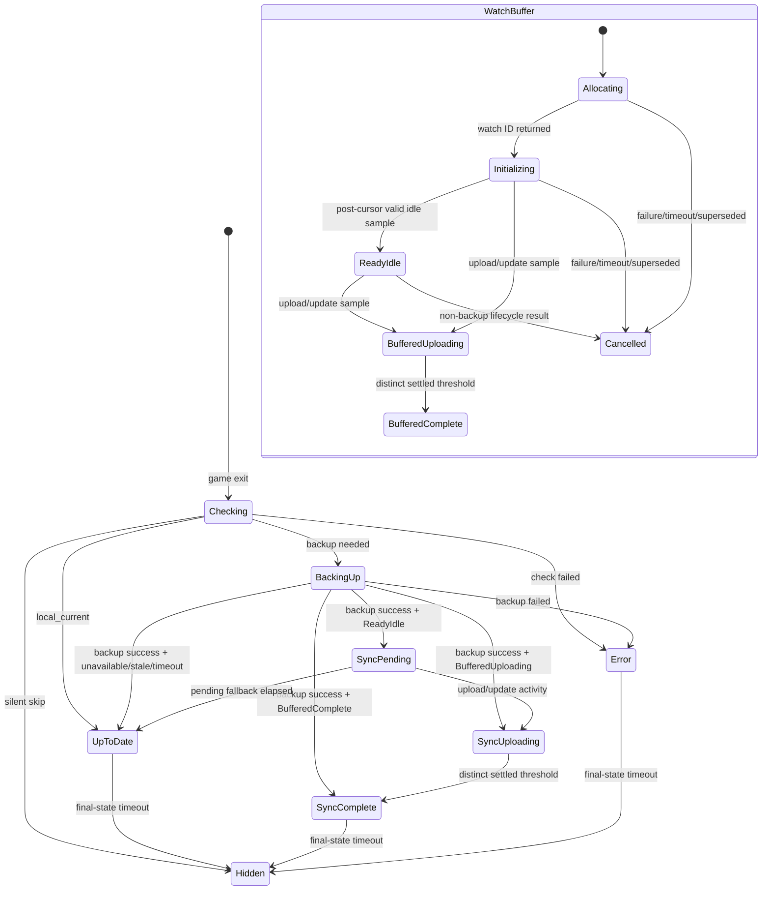

# Implementation Plan: Race-Safe Post-Backup Syncthing Status Handoff

## Problem Definition

On the current `0.3.0` development branch, a successful post-game Ludusavi backup can
briefly show:

```text
GAME SAVE UP TO DATE
```

and hide before the Syncthing monitor later publishes:

```text
SYNCTHING UPLOADING
```

The visible gap makes one logical autosync operation look like two unrelated
operations. The first version of this plan proposed a
`syncthing_pending_upload` presentation state gated only on the backend returning a
watch ID. Review found that insufficient:

1. the backend returns `watching` before its worker thread has initialized;
2. post-game polling can observe and publish upload activity before backup completion;
3. the controller could then overwrite `SYNCTHING UPLOADING` with the less advanced
   `SYNCTHING PREPARING` state;
4. a locally timed-out start promise could still resolve and publish activity later;
5. no-change and other non-backup paths could leave an irrelevant watch active;
6. the proposed Jest examples were not runnable by the repository's current frontend
   toolchain;
7. the backend publishes a finite-timestamp baseline before event-cursor initialization,
   so the first populated sample does not currently prove full watch readiness;
8. monitor generations alone cannot stop an older asynchronous lifecycle handler from
   publishing a local result over a newer game's status.

This revision replaces watch-ID gating with a generation-scoped, buffered handoff
protocol. Post-game monitoring starts before the backup so it can observe filesystem
activity, but it cannot publish user-facing Syncthing states until the lifecycle
controller successfully completes the backup and activates that exact watch
generation.

## Product Decisions

### What counts as a confirmed watch?

A watch is confirmed only after all of the following are true:

1. the backend returned a watch ID;
2. the backend completed strict initial folder-state and event-cursor acquisition;
3. frontend polling received the first populated, valid activity sample published after
   that initialization boundary;
4. the sample contains a finite `timestamp_unix`;
5. the watch still belongs to the current monitor generation;
6. no initialization failure, stop result, timeout, or superseding lifecycle event has
   invalidated it.

A returned watch ID alone is not confirmation. The backend currently starts its daemon
thread and returns `watching` before initial folder-state and event-cursor acquisition
complete, so watch allocation cannot prove the watcher is operational. The existing
baseline-before-cursor behavior must change: polling returns an empty startup sample
until both initialization steps succeed, then the backend publishes the first populated
baseline. Any failure before that publication produces `watch_initialization_failed`.

### What happens when watch confirmation is late?

If the exact post-game generation is not confirmed within the handoff gate after a
successful backup:

1. cancel that generation;
2. stop its backend watch immediately if a watch ID is known;
3. arrange for a late watch-ID result to be stopped when it arrives;
4. resolve the handoff as unavailable;
5. show `GAME SAVE UP TO DATE`;
6. never transition from that fallback result into a late Syncthing state.

Continuity is more important than surfacing a late advisory signal. A late transition
would recreate the original disappear-and-reappear defect.

### What test framework should be used?

Add exact-pinned `vitest@4.1.8` as a development dependency and use it for executable
TypeScript unit tests. The behavior under change depends on promises, fake timers,
generations, and publication ordering; `tests/test_frontend_static.py` can enforce
architecture markers but cannot prove those runtime properties.

Use Vitest's default Node environment. Mock `@decky/ui` and provide only the minimal
`globalThis.window` timer and Steam stubs required by each test. Do not add `jsdom`,
React Testing Library, or another UI test dependency. The selected Vitest version
supports the repository's local Node 22.22.2 and CI Node 24 environments.

### What activity does the watch attribute to this backup?

The existing backend resolves the Syncthing folder containing Ludusavi's backup path
and reports activity for that folder. It does not correlate individual Syncthing events
to one game's backup subdirectory.

Keep that folder-level advisory behavior for this fix. Activity elsewhere in the same
shared Ludusavi backup folder may be displayed during the handoff. Path-level or
game-level event attribution is a separate backend feature and is explicitly out of
scope. User-facing copy must describe Syncthing folder activity and must not claim that
the observed transfer exclusively belongs to the game that just exited.

### What happens when monitoring fails after handoff activation?

- If the watch fails or stops while activated but before upload/update activity has
  been observed, cancel the generation and publish `GAME SAVE UP TO DATE` exactly once.
- If upload/update activity was already observed, stop monitoring without publishing
  `SYNCTHING COMPLETE`, `GAME SAVE UP TO DATE`, or `UNABLE TO SYNC`. The existing
  ten-second active-state watchdog hides the last truthful Syncthing state.
- Monitoring failure remains advisory and never changes the successful local backup
  result into an error.

### How are overlapping lifecycle handlers prevented from overwriting each other?

The lifecycle controller owns a monotonically increasing lifecycle epoch that is
separate from the monitor generation. Increment it at every app start, app exit, and
controller disposal. Every asynchronous lifecycle handler captures its epoch and may
publish, complete, or hide the shared status surface only while that epoch is current.

Stale handlers must still finish RPC cleanup, history synchronization, logging, process
resume, and failure notification as applicable; only stale status-surface mutations are
suppressed. Every new lifecycle entry also invalidates any active Syncthing generation,
even when the new event is untracked or autosync-disabled and does not start another
watch.

## Objective

For a changed post-game save with a functioning Syncthing watch, show one continuous,
monotonic sequence:

```text
VERIFYING GAME SAVE
BACKING UP LOCAL SAVE
SYNCTHING PREPARING
SYNCTHING UPLOADING
SYNCTHING COMPLETE
```

When activity was already observed while the backup was running, skip the obsolete
preparing state:

```text
VERIFYING GAME SAVE
BACKING UP LOCAL SAVE
SYNCTHING UPLOADING
SYNCTHING COMPLETE
```

When the watch initialized but no upload activity appears during the pending window:

```text
VERIFYING GAME SAVE
BACKING UP LOCAL SAVE
SYNCTHING PREPARING
GAME SAVE UP TO DATE
```

When Syncthing is unavailable, initialization fails, or confirmation times out:

```text
VERIFYING GAME SAVE
BACKING UP LOCAL SAVE
GAME SAVE UP TO DATE
```

The status sequence must never regress:

```text
SYNCTHING UPLOADING -> SYNCTHING PREPARING
SYNCTHING COMPLETE -> SYNCTHING PREPARING
GAME SAVE UP TO DATE -> late SYNCTHING UPLOADING
```

## Scope

Primary implementation files:

```text
src/types/index.ts
src/surfaces/autoSyncStatusSurface.tsx
src/controllers/syncthingMonitor.ts
src/controllers/gameLifecycleController.tsx
py_modules/sdh_ludusavi/syncthing/watcher.py
package.json
pnpm-lock.yaml
```

Primary executable frontend tests:

```text
src/controllers/syncthingMonitor.test.ts
src/controllers/gameLifecycleController.test.ts
src/surfaces/autoSyncStatusSurface.test.ts
```

Existing regression fences to update:

```text
tests/test_frontend_static.py
tests/test_watcher.py
```

Documentation/session artifacts:

```text
docs/agent_conversations/
```

A narrow Python runtime correction is required: do not publish the first populated
baseline until strict initial folder-state and event-cursor acquisition both succeed.
Preserve the existing RPC envelopes and `watch_initialization_failed` result.

## Non-Goals

- Do not publish a pending state merely because autosync is enabled and the game is
  tracked.
- Do not treat allocation of a backend watch ID as operational confirmation.
- Do not claim upload activity before a valid Syncthing sample reports it.
- Do not add `syncthing_pending_download`.
- Do not change Ludusavi operation result types.
- Do not make Syncthing failure invalidate a successful local backup.
- Do not allow post-game Syncthing callbacks to replace `checking` or `backing_up`
  before the backup handoff is activated.
- Do not permit timed-out, cancelled, or superseded watches to publish later.
- Do not use static source assertions as the only regression coverage for ordering,
  cancellation, or timer behavior.
- Do not publish, tag, merge, or dispatch a release as part of this plan.
- Do not add path-level or per-game Syncthing event attribution.
- Do not treat a polling failure after observed upload as evidence of completion,
  local-only success, or sync failure.

## Architecture Overview

### Status surface

`src/surfaces/autoSyncStatusSurface.tsx` owns presentation:

- `syncthing_pending_upload` text and icon;
- active-state visibility;
- ordinary BrowserView show/hide timing.

### Syncthing monitor

`src/controllers/syncthingMonitor.ts` owns watch execution and evidence:

- monotonically increasing monitor generations;
- backend start, poll, and stop RPCs;
- first-valid-sample readiness;
- buffered post-game semantic state before handoff;
- cancellation and late-result cleanup;
- publication only after post-game handoff activation;
- upload/completion sample mapping.

### Lifecycle controller

`src/controllers/gameLifecycleController.tsx` owns lifecycle policy:

- start a post-game monitor generation before `check_game_exit`;
- activate that exact generation only after `backup_game_on_exit` returns `backed_up`;
- stop the generation on every path that does not produce a successful backup;
- maintain a controller lifecycle epoch for shared status-surface authority;
- suppress status mutations from stale asynchronous lifecycle continuations;
- map handoff outcomes to the correct UI state.

### Core ownership rule

The monitor observes Syncthing; the lifecycle controller authorizes post-game
publication; the surface renders authorized states. No layer may infer evidence owned
by another layer.

The monitor generation and controller lifecycle epoch solve different races and must
not be collapsed into one token. Monitor generations own watch allocation, polling,
timers, and backend cleanup. Lifecycle epochs own authority to mutate the shared status
surface across overlapping start and exit handlers.

## Core Data Structures

### Presentation status

Add:

```ts
export type AutoSyncStatusKind =
  | "checking"
  | "backing_up"
  | "restoring"
  | "conflict"
  | "has_backup"
  | "unknown"
  | "error"
  | "syncthing_pending_upload"
  | "syncthing_downloading"
  | "syncthing_uploading"
  | "syncthing_complete";
```

`syncthing_pending_upload` remains frontend-only.

### Generation identity

Every `SyncthingMonitor.start()` call receives a unique numeric generation:

```ts
export type SyncthingMonitorGeneration = number;
```

The generation, not `gameName` plus `appID`, is the authoritative lifecycle identity.
Names and IDs are metadata and may repeat across consecutive lifecycle events.

### Start handle

`start()` should synchronously return ownership of a generation while backend
allocation and initialization continue internally:

```ts
export type SyncthingMonitorStartHandle = Readonly<{
  generation: SyncthingMonitorGeneration;
  phase: "pre_game" | "post_game";
  gameName: string;
  appID: string;
}>;
```

The handle deliberately contains no `watching` or `ready` boolean. It proves only that
the frontend monitor created and owns a generation. Allocation, initialization, and
activity remain asynchronous monitor state.

### Handoff result

After successful backup, the controller asks the monitor to activate the exact
generation:

```ts
export type PostGameHandoffResult =
  | {
      status: "pending";
      generation: SyncthingMonitorGeneration;
    }
  | {
      status: "uploading";
      generation: SyncthingMonitorGeneration;
    }
  | {
      status: "complete";
      generation: SyncthingMonitorGeneration;
    }
  | {
      status: "unavailable";
      generation: SyncthingMonitorGeneration;
      reason: string;
    }
  | {
      status: "stale";
      generation: SyncthingMonitorGeneration;
    };
```

Meaning:

- `pending`: first valid sample confirmed an operational watch, but upload/update
  activity has not been observed.
- `uploading`: upload/update activity was already observed while UI publication was
  buffered.
- `complete`: activity and the required distinct settled samples were already observed
  while UI publication was buffered.
- `unavailable`: allocation, initialization, confirmation, or timeout failed.
- `stale`: another generation superseded the requested lifecycle.

### Watch context

Extend the private monitor context:

```ts
interface WatchContext {
  watchID: string | null;
  generation: SyncthingMonitorGeneration;
  phase: "pre_game" | "post_game";
  gameName: string;
  appID: string;
  source: "lifecycle_start" | "lifecycle_exit";
  startedAt: number;
  initialized: boolean;
  cancelled: boolean;
  publicationEnabled: boolean;
  activityObserved: boolean;
  completionObserved: boolean;
  settledCount: number;
  lastProcessedTimestamp: number | null;
  latestStatus: "idle" | "uploading" | "downloading" | "complete";
}
```

The implementation may use private deferred-promise fields or waiter collections, but
must preserve these semantic facts.

### Lifecycle epoch

Keep a private controller counter:

```ts
let lifecycleEpoch = 0;
```

Each `handleAppStart` and `handleAppExit` invocation synchronously increments and
captures the next epoch before its first status publication. `dispose()` increments the
epoch before cleanup. Status publication helpers receive or close over the captured
epoch and no-op when it no longer matches `lifecycleEpoch`.

## State Machine



## Public Interfaces

### `SyncthingMonitor.start`

```ts
start(
  phase: "pre_game" | "post_game",
  gameName: string,
  appID: string,
): SyncthingMonitorStartHandle
```

Requirements:

1. increment and capture a new generation;
2. synchronously invalidate the previous generation and initiate its asynchronous
   cleanup;
3. create the context before awaiting the backend start RPC, with `watchID: null`;
4. launch backend allocation through a private asynchronous task;
5. synchronously return the immutable generation handle without waiting for the RPC;
6. if the RPC resolves after cancellation, stop the returned watch ID;
7. assign the watch ID only while the generation remains current;
8. begin serialized polling immediately after allocation;
9. resolve internal readiness as unavailable on handled allocation failure;
10. preserve existing non-blocking pre-game use.

### `SyncthingMonitor.activatePostGameHandoff`

```ts
async activatePostGameHandoff(
  generation: SyncthingMonitorGeneration,
  confirmationTimeoutMs: number,
  pendingActivityTimeoutMs: number,
): Promise<PostGameHandoffResult>
```

Requirements:

1. accept only the current post-game generation;
2. wait for its first valid sample or terminal failure;
3. on timeout, cancel and stop the same generation before resolving;
4. atomically set `publicationEnabled = true` only for a confirmed generation;
5. return the most advanced buffered state:
   `complete > uploading > pending`;
6. never return `pending` after activity or completion was observed;
7. when returning `pending`, schedule a generation-scoped activity timeout;
8. cancel publication authority before emitting the pending fallback;
9. never enable publication for unavailable, stale, or cancelled generations.

The timeout belongs inside the monitor because only the monitor can safely invalidate
the generation and clean up a watch that resolves late. Do not use a generic controller
`withTimeout()` wrapper around the start promise.

### `SyncthingMonitor.cancelGeneration`

```ts
async cancelGeneration(
  generation: SyncthingMonitorGeneration,
  reason: string,
): Promise<void>
```

Requirements:

- mark the context cancelled before awaiting RPC cleanup;
- clear its poll timeout;
- invalidate readiness/handoff waiters;
- stop its known watch ID;
- if watch allocation is still in flight, make the eventual result take the stale
  cleanup path;
- be idempotent.

### Status callback

Expand the monitor callback source type to the existing shared
`AutoSyncStatusSource`, or at minimum include `"timeout"`, because the monitor-owned
pending expiration publishes the final `has_backup` transition:

```ts
export type StatusCallback = (
  status: AutoSyncStatusKind,
  options: {
    source: AutoSyncStatusSource;
    gameName: string;
    appID: string;
  },
) => void;
```

The timeout callback must use metadata captured from the cancelled generation. It must
not read identity from a newer current context.

### Test observability

Prefer behavior assertions over production-only debug APIs. If minimal test
observability is needed, expose a read-only snapshot:

```ts
getSnapshotForTest(): Readonly<{
  generation: number | null;
  phase: "pre_game" | "post_game" | null;
  initialized: boolean;
  publicationEnabled: boolean;
  activityObserved: boolean;
  completionObserved: boolean;
}> 
```

Do not add `isWatchingPostGame(name, appID)` as the primary safety check; it cannot
distinguish consecutive generations for the same game.

## Monitor Processing Rules

### First valid sample

A populated poll result confirms initialization only when the backend has crossed the
strict initialization boundary and:

```ts
pollRes.status === "activity" &&
pollRes.sample !== null &&
typeof pollRes.sample === "object" &&
Number.isFinite(pollRes.sample.timestamp_unix)
```

An empty sample retries after the existing startup retry delay and does not resolve
readiness.

A failed/skipped poll result or backend `stopped` result resolves readiness as
unavailable and clears the generation.

The backend must not expose a populated baseline before event-cursor acquisition. In
`SyncthingWatch._run()`, acquire strict initial folder state and the event cursor first,
then publish the baseline and enter the polling loop. Initialization exceptions publish
`watch_initialization_failed`. Do not use the existing best-effort
`get_initial_folder_state_and_runtime()` fallback as readiness evidence; add or use a
strict initialization path that propagates the initial status failure.

### Buffered post-game publication

For `post_game` contexts with `publicationEnabled === false`:

- process every distinct sample normally;
- update `activityObserved`, `settledCount`, `completionObserved`, and `latestStatus`;
- do not call `onStatus`;
- do not discard completion evidence merely because handoff has not activated yet.

For pre-game contexts, preserve current immediate publication behavior.

For activated post-game contexts, publish normally.

### Activated polling failure

When a poll returns failed/skipped/stopped or throws after activation:

1. synchronously disable publication and clear generation-owned timers;
2. initiate backend stop cleanup if a watch ID remains known;
3. if `activityObserved === false`, publish one generation-scoped `has_backup` callback
   with `source: "rpc_result"`;
4. if `activityObserved === true`, publish no replacement status and let the surface's
   active-state watchdog hide the last truthful status;
5. prevent every late poll, timeout, or RPC result from publishing.

### Monotonic status ordering

Use an internal rank:

```text
idle = 0
uploading = 1
complete = 2
```

Post-game processing may advance but never lower the buffered rank. A later idle
sample after activity must not turn `uploading` back into `pending`.

### Completion before activation

If activity and three distinct settled samples occur before backup completion,
`activatePostGameHandoff()` returns `complete`. The controller publishes
`syncthing_complete` directly. This is truthful because activity was observed first;
the UI is not required to replay every transient state after the fact.

### Poll and callback race

`activatePostGameHandoff()` must synchronously enable publication and return its
snapshot without an intervening `await` after readiness is established. After the
controller's `await` resumes, it must synchronously publish the returned initial state
before performing another asynchronous operation. JavaScript run-to-completion then
prevents a subsequent poll callback from being overwritten by the initial handoff
publication.

## Lifecycle Controller Flow

### Acquire lifecycle publication authority

At the beginning of every start and exit handler:

```ts
const epoch = ++lifecycleEpoch;
```

Before starting a new lifecycle operation, invalidate the prior Syncthing generation.
This applies even if the new event is untracked or autosync-disabled. Wrap shared
surface operations in epoch-aware helpers so `publish`, `complete`, and `hide` execute
only when `epoch === lifecycleEpoch`.

Do not use the epoch to skip backend RPC completion, monitor cleanup, history refresh,
logging, process resume, or failure notifications.

### Start and retain the generation

At the start of `handleAppExit`, after computing tracked and autosync state:

```ts
const postGameWatch = autoSyncEnabledExit && tracked
  ? syncthingMonitor.start("post_game", name, appID)
  : null;
```

This call returns synchronously. Backend allocation and initialization remain
concurrent with `checkGameExitCall`, while the controller immediately retains the
generation identity and cancellation authority.

The watch must begin before `backupGameOnExitCall` so it can observe backup writes.

### Successful backup

After `backupGameOnExitCall` returns `backed_up`:

```ts
const generation = postGameWatch?.generation ?? null;

const handoff = generation === null
  ? {
      status: "unavailable" as const,
      generation: -1,
      reason: "watch_not_started",
    }
  : await syncthingMonitor.activatePostGameHandoff(
      generation,
      SYNCTHING_HANDOFF_CONFIRMATION_MS,
      SYNCTHING_PENDING_ACTIVITY_MS,
    );

switch (handoff.status) {
  case "pending":
    publishAutoSyncStatus("syncthing_pending_upload", lifecycleOptions);
    return;
  case "uploading":
    publishAutoSyncStatus("syncthing_uploading", lifecycleOptions);
    return;
  case "complete":
    publishAutoSyncStatus("syncthing_complete", lifecycleOptions);
    return;
  case "unavailable":
  case "stale":
    completeAutoSyncStatus(result, completionOptions);
    return;
}
```

The exact code should avoid a fake `-1` generation by using a helper or explicit
branch. It is shown only to make the result mapping clear.

### Every non-success path stops the generation

Cancel the retained generation before returning from:

- silent skip;
- `local_current`;
- any other non-backup check result;
- backup failure;
- thrown lifecycle error;
- controller disposal;
- a superseding app lifecycle event.

An app start, app exit, or disposal supersedes all older lifecycle publication
authority. An older handler that resumes after a newer epoch starts may finish its
non-visual work but must not mutate the status strip.

For `local_current`, complete the status as `has_backup` only after cancellation is
initiated. No post-game watch may remain able to publish activity when no backup was
written.

Use a small controller helper to avoid missing paths:

```ts
async function cancelPostGameWatch(reason: string): Promise<void> {
  if (postGameWatch !== null) {
    await syncthingMonitor.cancelGeneration(
      postGameWatch.generation,
      reason,
    );
  }
}
```

Cancellation cleanup must not turn a successful local backup into a UI error.

## Status Surface Changes

### Text and icon

Add:

```ts
syncthing_pending_upload: "SYNCTHING PREPARING"
```

Reuse `IoMdCloudUpload` for `syncthing_pending_upload`.

### Active visibility

Treat pending as an active Syncthing status:

```ts
function isSyncthingActiveStatus(status: AutoSyncStatusKind): boolean {
  return (
    status === "syncthing_pending_upload" ||
    status === "syncthing_downloading" ||
    status === "syncthing_uploading"
  );
}
```

### Pending fallback

The 8-second pending activity timer belongs exclusively to `SyncthingMonitor`.
Presentation and publication authority must expire atomically.

When `activatePostGameHandoff()` returns `pending`, the monitor schedules a timeout
capturing the exact generation. On expiry it must:

1. verify that the same generation is current, activated, initialized, and still idle;
2. mark the generation cancelled and disable publication;
3. clear polling state;
4. initiate backend watch cleanup;
5. publish one `has_backup` callback with `source: "timeout"`;
6. prevent every late sample or RPC result from publishing.

If upload or completion is observed first, clear the pending timeout before publishing
the advanced status.

The surface owns only its existing display hide/show timers. It must not implement a
second pending fallback timer. Comparing `gameName` and `appID` is not an acceptable
substitute for monitor generation identity.

Activated monitor failure uses the same generation-captured metadata and cancellation
rules. Before activity it falls back once to `has_backup`; after activity it publishes
nothing and relies on the existing active-state watchdog.

## Timing Policy

Use named constants:

```ts
const SYNCTHING_HANDOFF_CONFIRMATION_MS = 750;
const SYNCTHING_PENDING_ACTIVITY_MS = 8_000;
```

Interpretation:

- 750 ms is additional waiting after successful backup for a first valid sample. The
  watch has already been initializing during `check_game_exit` and backup execution.
- 8 seconds is the confirmed-idle pending window before falling back to local backup
  success.

These are initial product constants, not protocol truths. Log elapsed initialization
and pending times so Deck QA can validate them. If field evidence shows normal Steam
Deck initialization exceeds 750 ms, adjust the constant with measured data rather
than silently weakening confirmation.

## Logging Requirements

Add stable, searchable logs for:

```text
Syncthing watch allocated: generation=<n> watch_id=<id> game=<name> app_id=<id>
Syncthing watch initialized: generation=<n> elapsed_ms=<n>
Syncthing handoff activated: generation=<n> state=<pending|uploading|complete>
Syncthing handoff confirmation timed out: generation=<n> elapsed_ms=<n>
Syncthing generation cancelled: generation=<n> reason=<reason>
Syncthing late watch allocation stopped: generation=<n> watch_id=<id>
Syncthing pending activity timed out: generation=<n>
Syncthing upload activity observed: generation=<n>
```

Do not log API keys, Syncthing credentials, or full configuration documents.

## Dependency Requirements

Add exact-pinned Vitest as a development dependency using pnpm through the project wrapper:

```bash
./run.sh pnpm add --save-dev --save-exact vitest@4.1.8
```

Update scripts to provide explicit unit and aggregate gates:

```json
{
  "scripts": {
    "test:unit": "vitest run",
    "test": "pnpm run test:unit && pnpm run typecheck"
  }
}
```

Preserve existing `typecheck`, `build`, `audit`, and `verify` scripts.

Vitest configuration should be minimal. Use the default Node environment, mock
`@decky/ui`, and stub `globalThis.window` timers and Steam APIs where required. Do not
add `jsdom`, React Testing Library, or another UI framework for this change.

## Testing Strategy

Strict Red-Green-Refactor applies. Add each failing test before its implementation and
run it through `./run.sh`.

### Monitor unit tests

Cover:

1. `start()` synchronously returns a generation handle without confirming readiness;
2. empty samples do not confirm initialization;
3. a pre-cursor baseline cannot confirm readiness;
4. first post-cursor valid finite-timestamp sample confirms readiness;
5. initialization failure resolves handoff unavailable;
6. post-game upload before activation is buffered and not published;
7. activation after buffered upload returns `uploading`, never `pending`;
8. buffered completion returns `complete`;
9. activated upload publishes subsequent status callbacks;
10. confirmation timeout cancels and stops a known watch;
11. late allocation after timeout is stopped and cannot publish;
12. superseding generation invalidates the earlier generation;
13. consecutive generations for the same game/app remain distinct;
14. cancellation is idempotent;
15. three distinct settled timestamps are still required for completion;
16. activated failure before activity publishes one `has_backup`;
17. activated failure after activity publishes no replacement state or completion.

### Lifecycle controller unit tests

Cover:

1. successful backup plus initialized idle watch publishes pending;
2. successful backup plus buffered activity publishes uploading directly;
3. successful backup plus buffered completion publishes complete directly;
4. unavailable or timed-out handoff completes as `has_backup`;
5. backup failure cancels the generation and publishes error;
6. `local_current` cancels the generation before normal completion;
7. silent skip cancels the generation and hides;
8. thrown check/backup errors cancel the generation;
9. no post-game Syncthing publication occurs before backup success;
10. a late result after fallback cannot replace `has_backup`;
11. a newer app start suppresses an older exit handler's late surface completion;
12. a newer exit suppresses an older exit handler for the same game/app;
13. untracked or autosync-disabled lifecycle entry supersedes and cancels the prior
    watch;
14. stale handlers still run required history synchronization and non-visual cleanup.

### Status surface unit tests

Cover:

1. pending text is exactly `SYNCTHING PREPARING`;
2. pending uses the cloud-upload icon;
3. pending uses active visibility behavior;
4. reset/hide/dispose clears all presentation timers.

If the pending activity timeout is correctly owned by the monitor, do not duplicate
its behavioral timer tests in the surface suite.

### Static pytest fences

Update `tests/test_frontend_static.py` to assert:

- the new status kind and text exist;
- the monitor exposes generation-scoped activation and cancellation;
- controller code uses the returned generation;
- no generic `withTimeout()` handoff wrapper is introduced;
- `package.json` includes `test:unit`;
- the three Vitest test files exist.

Static tests are supplementary and must not substitute for Vitest behavior tests.

### Backend tests

Existing watcher tests must continue proving:

- startup failure produces a consumable failed poll result;
- startup empty samples are temporary;
- no populated sample is exposed before strict cursor initialization completes;
- cursor or initial folder-state failure cannot leave an apparently ready baseline;
- samples carry finite timestamps;
- watch stop is idempotent.

Update `tests/test_watcher.py` for the required backend readiness correction.

## Manual QA

### Changed save, normal Syncthing

Expected:

```text
VERIFYING GAME SAVE
BACKING UP LOCAL SAVE
SYNCTHING PREPARING
SYNCTHING UPLOADING
SYNCTHING COMPLETE
```

No disappearance or regression is permitted.

### Activity starts during backup

Expected:

```text
VERIFYING GAME SAVE
BACKING UP LOCAL SAVE
SYNCTHING UPLOADING
SYNCTHING COMPLETE
```

`SYNCTHING PREPARING` may be skipped. It must not appear after uploading.

### Initialization failure or Syncthing unavailable

Expected:

```text
VERIFYING GAME SAVE
BACKING UP LOCAL SAVE
GAME SAVE UP TO DATE
```

No late Syncthing state may appear.

### Confirmation timeout followed by late backend response

Artificially delay watch allocation or first valid sample beyond 750 ms.

Expected:

```text
VERIFYING GAME SAVE
BACKING UP LOCAL SAVE
GAME SAVE UP TO DATE
```

Logs must show cancellation and late cleanup. The strip must remain final.

### Initialized watch with no activity

Expected:

```text
VERIFYING GAME SAVE
BACKING UP LOCAL SAVE
SYNCTHING PREPARING
GAME SAVE UP TO DATE
```

After fallback, that generation must be cancelled and must not publish later activity.

### No changed save

Expected:

```text
VERIFYING GAME SAVE
GAME SAVE UP TO DATE
```

The post-game watch is stopped. Unrelated Syncthing folder activity must not alter the
strip.

### Consecutive exits for the same game

Trigger two lifecycle generations for the same game and app ID.

Expected:

- only the newest generation can publish;
- old timers and late RPC results cannot replace the new lifecycle state.

### Poll failure after handoff activation

Before upload activity, a failed or stopped watch must fall back once to:

```text
GAME SAVE UP TO DATE
```

After upload activity, the last truthful Syncthing state remains until the existing
watchdog hides it. Do not publish complete, local success, or error.

### Overlapping game lifecycles

Delay game A's check, backup, or handoff, then begin game B's lifecycle.

Expected:

- game B owns all later status-strip publications;
- game A still completes cleanup, history synchronization, and logging;
- game A cannot hide or overwrite game B's status.

## Edge-Case Rules

- A successful local backup remains successful when Syncthing is unavailable.
- A paused Syncthing folder may initialize as idle, show preparing, and fall back to
  up-to-date; it is not a local backup error.
- A remote device being offline is not sufficient evidence for `UNABLE TO SYNC`.
- Upload completion may be shown only after upload/update activity was observed.
- If completion is observed while buffered, publish complete directly after backup;
  do not replay stale intermediate states.
- A backend stopped result before activation makes the handoff unavailable.
- A backend stopped result after activation ends monitoring without inventing
  completion.
- Lifecycle generation identity overrides matching game/app metadata.
- Plugin disposal cancels all generations, timers, polls, and waiter promises.
- Pre-game restore behavior remains immediate and is not routed through the post-game
  publication gate.
- Syncthing evidence remains folder-scoped; unrelated activity in the same configured
  folder is a documented advisory limitation.
- Status-surface authority belongs only to the newest lifecycle epoch.

## Implementation Phases

### Phase 1: Commit the reviewed plan

Commit this documentation-only revision before behavior changes:

```text
docs(syncthing): harden post-backup handoff plan
```

### Phase 2: Add executable frontend test infrastructure

1. verify and add pinned Vitest;
2. add `test:unit`;
3. add a minimal smoke test;
4. run the gate and commit:

```text
test(frontend): add executable unit test harness
```

### Phase 3: Backend readiness contract

1. write failing watcher tests proving no populated baseline appears before strict
   folder-state and cursor initialization;
2. implement the narrow backend initialization-order correction;
3. preserve RPC envelopes and failure reasons;
4. commit:

```text
fix(syncthing): confirm watcher readiness after cursor initialization
```

### Phase 4: Generation and buffered monitor behavior

1. write failing monitor tests;
2. implement generation-scoped start, readiness, buffering, activation, timeout, and
   cancellation;
3. preserve pre-game behavior;
4. commit:

```text
fix(syncthing): serialize post-game handoff state
```

### Phase 5: Lifecycle integration

1. write failing controller tests;
2. retain the exact generation;
3. activate only after successful backup;
4. add lifecycle epoch publication authority;
5. cancel every non-success and superseding path;
6. commit:

```text
fix(lifecycle): gate Syncthing status on backup handoff
```

### Phase 6: Pending presentation

1. write failing surface tests;
2. add the status text, icon, and active behavior;
3. keep pending activity timeout ownership in the monitor;
4. commit:

```text
feat(status-strip): show Syncthing preparing handoff
```

### Phase 7: Static fences and documentation

1. update `tests/test_frontend_static.py`;
2. update relevant specs if the final behavior differs from
   `docs/specs/custom_status_bar_ui.md`;
3. add the required session log;
4. commit:

```text
docs(syncthing): record race-safe handoff behavior
```

## Validation

Run all project commands through `./run.sh`:

```bash
./run.sh pnpm run test:unit
./run.sh pnpm run typecheck
./run.sh pnpm run build
./run.sh uv run ruff check . --fix
./run.sh uv run ruff format .
./run.sh uv run ty check py_modules/sdh_ludusavi/
./run.sh uv run pytest
```

Before each commit, run the repository pre-commit hook or its documented command.
Avoid broad formatting of unrelated user-modified files.

If `pnpm run verify` is part of the active branch's required frontend gate, run:

```bash
./run.sh pnpm run verify
```

Report network-only `pnpm audit` failures separately from local typecheck, unit-test,
and build results.

After all implementation commits, run the requested branch review loop against the
parent feature branch:

```bash
npx @openai/codex review --branch feat/syncthing-status-strip-activity
```

Address every valid finding with a focused test-first fix and repeat until no valid
blocking findings remain.

## Acceptance Criteria

- `syncthing_pending_upload` renders as `SYNCTHING PREPARING` with the upload-cloud
  icon.
- A backend watch ID alone never authorizes the pending status.
- Only a post-cursor valid finite-timestamp sample confirms watch initialization.
- Cursor or strict initial folder-state failure cannot expose an apparently ready
  populated baseline.
- Post-game Syncthing states are buffered until successful backup activation.
- Buffered upload activity produces `SYNCTHING UPLOADING` directly.
- Buffered completion produces `SYNCTHING COMPLETE` directly.
- No status can regress from uploading or complete to preparing.
- Confirmation timeout cancels the exact generation.
- Late allocation or samples after timeout are stopped and cannot publish.
- `local_current`, silent skip, backup failure, exceptions, supersession, and disposal
  cancel their post-game generation.
- Consecutive lifecycles for the same game/app are isolated by generation.
- Only the newest controller lifecycle epoch may mutate the shared status surface.
- Stale lifecycle handlers still complete required non-visual cleanup and history work.
- Pending idle fallback cancels publication authority before showing
  `GAME SAVE UP TO DATE`.
- Activated failure before activity publishes local backup success exactly once.
- Activated failure after activity publishes no unsupported replacement status.
- Folder-level Syncthing attribution is preserved and documented as advisory.
- Vitest covers asynchronous ordering, timers, cancellation, and stale generations.
- Static pytest tests remain a supplementary architecture fence.
- Existing pre-game Syncthing behavior remains unchanged.
- Existing Python, frontend typecheck, frontend build, and unit-test gates pass.
- A session summary is recorded in `docs/agent_conversations/`.

## Release Note

Suggested user-facing note:

```text
Improved post-game autosync status continuity by securely handing successful backups
off to confirmed Syncthing activity without gaps or stale status transitions.
```

No release action is authorized by this plan.
