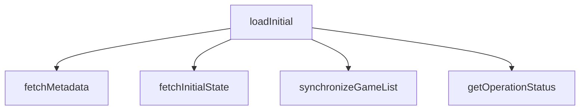

# Plan: Decompose loadInitial God Function

## Problem Definition
`loadInitial` in `src/index.tsx` is a "God function" handling RPC orchestration, state normalization, cache validation, conditional game refreshing, and error handling for the entire plugin startup in a single long block, making it hard to read, maintain, and test.

## Architecture Overview
The refactoring decomposes `loadInitial` into three focused helpers:
1. `fetchMetadata`: Non-blocking background loader for versions and discovery commands.
2. `fetchInitialState`: Concurrently fetches and normalizes settings and history.
3. `synchronizeGameList`: Manages game cache verification and game refreshes.

These helpers are defined within the `Content` component after `loadInitial` and before `applyCachedRefreshResult` (or `applyRefreshResult`), preserving closure access to React hook state, setters, and the active `isMounted` ref.

## Core Data Structures
No new data structures are introduced. The helper functions operate on existing structures: `Settings`, `GameStatus`, `GameOperationHistory`, `Versions`, `RpcResult`, and the `ludusaviState` / `ludusaviStore` structures.

## Public Interfaces
The public API of the component is unaffected. The signature of `loadInitial` remains `async () => void`.
New private helper functions inside `Content`:
- `fetchMetadata(): void`
- `fetchInitialState(): Promise<RpcResult<Settings>>`
- `synchronizeGameList(isWarmed: boolean, loadedSettings: RpcResult<Settings>): Promise<void>`

## Dependency Requirements
No new dependencies. Standard React and project-level RPC calls.

## Testing Strategy
Static analysis tests in `tests/test_frontend_static.py` will be used to verify correctness.
The helpers will be kept within the text slice scanned by `test_frontend_static.py` (between `loadInitial` and `applyRefreshResult`) to ensure all existing static assertions pass successfully.
Run all tests via:
`./run.sh uv run pytest`
And run typecheck via:
`pnpm run typecheck`
