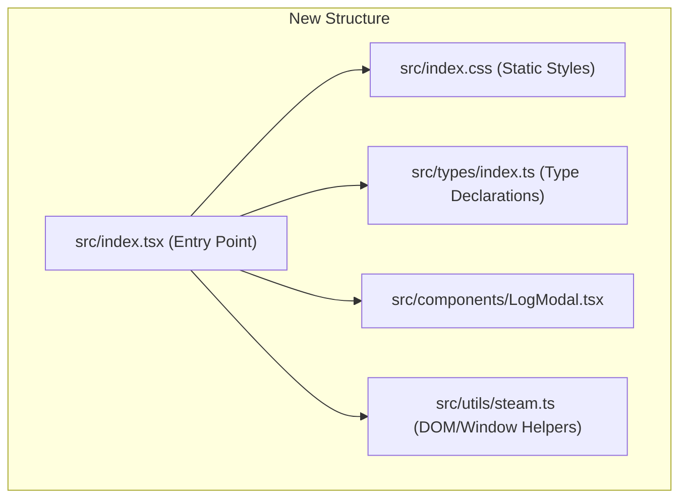

# Frontend Layout Refactoring Plan

## Problem Definition
The plugin's user interface styles are dynamically declared as a raw template string inside the main typescript file [src/index.tsx](file:///home/beallio/Dropbox/Scripts/SDH-ludusavi/src/index.tsx#L25) and rendered directly as a `<style>` block in the React rendering loop:
```tsx
return (
  <div ref={qamContentRef}>
    <style>{qamPanelStyles}</style>
    ...
  </div>
);
```
This forces the browser to re-parse the CSS declarations and perform full style recalculations and layout reflows on every single React render pass. 

Additionally, [src/index.tsx](file:///home/beallio/Dropbox/Scripts/SDH-ludusavi/src/index.tsx) is a monolithic component containing 2,621 lines of code, combining rendering, styling, helper utils, and state variables in one place.

## Architecture Overview
The goals of this refactor are:
1. Extract dynamic stylesheet injection from the render body and load CSS statically.
2. Modularize the monolithic [src/index.tsx](file:///home/beallio/Dropbox/Scripts/SDH-ludusavi/src/index.tsx) by moving styles, modals, types, and helper scripts into separate, dedicated files.



## Core Data Structures & Interfaces
No changes will be made to the underlying backend data structures or serialization contracts. 
* All TypeScript type definitions (such as `Settings`, `GameStatus`, `GameOperationHistoryEntry`, and `LifecycleCheckResult`) will be moved to `src/types/index.ts` and imported explicitly.

## Proposed Changes

### [NEW] [index.css](file:///home/beallio/Dropbox/Scripts/SDH-ludusavi/src/index.css)
Create a static CSS file to hold all styles previously stored in `qamPanelStyles`. This stylesheet will be imported at the top of `src/index.tsx`.

### [MODIFY] [index.tsx](file:///home/beallio/Dropbox/Scripts/SDH-ludusavi/src/index.tsx)
* Remove `qamPanelStyles` and the `<style>` injection.
* Import `./index.css` directly.
* Move type declarations, utility functions, and sub-components into separate files.

## Testing & Verification Strategy
To ensure layout refactoring does not break existing structures:
1. Run local frontend compilation:
   ```bash
   pnpm run typecheck
   pnpm run build
   ```
2. Confirm no regressions are introduced in the backend by running pytest:
   ```bash
   ./run.sh uv run pytest
   ```
3. Perform runtime visual validation in the SteamOS Game Mode interface to verify that layouts are styled correctly and no layout jitter/reflow is observable during UI updates.
