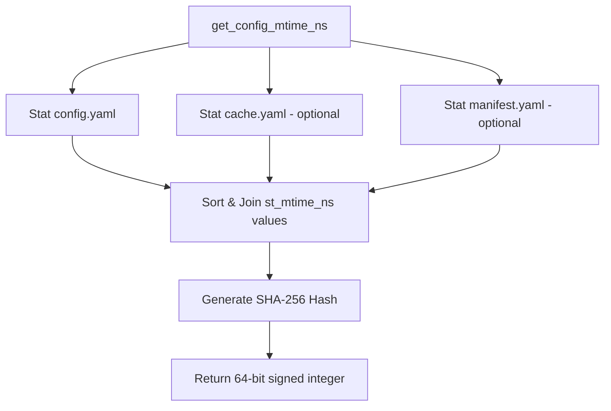

# Implementation Plan - Optimize Cache Marker Monitoring (Option 1)

## Problem Definition
The current implementation of `PyludusaviAdapter.get_config_mtime_ns` builds a composite hash of all state-carrying files (`config.yaml`, `cache.yaml`, `manifest.yaml`) as well as the backup directory itself, including scanning up to 2,000 subdirectories and checking `mapping.yaml` files inside each. 

This leads to:
1. **Severe Performance Bottlenecks**: Up to 4,000 synchronous `stat` disk calls are made on the main thread during cache checks, which blocks the Steam Deck UI.
2. **Brittle parsing**: The line-by-line helper `_parse_backup_path` is a naive YAML parser that has edge-case bugs (e.g., matching nested `path:` properties incorrectly and failing on inline comments).
3. **Non-deterministic hash limits**: Scanning direct subdirectories relies on arbitrary filesystem directory ordering, making the resulting SHA-256 hash non-deterministic when subdirectories exceed 2,000.

### Solution: Option 1
Simplify `get_config_mtime_ns` to only track the modification times of `config.yaml`, `cache.yaml`, and `manifest.yaml`. These configuration and database files change whenever any backup, restore, manifest update, or configuration change is triggered by Ludusavi (GUI/CLI). This removes the need to parse the backup path or scan the backups directory.

---

## Architecture Overview
The system utilizes a composite modification time (represented as a 64-bit signed integer hash) to validate the freshness of cached game statuses and custom game titles/aliases. By restricting monitoring to the configuration directory's three core YAML metadata files, the architecture transitions from $O(N)$ (where $N$ is the number of backed-up games) to $O(1)$ constant time complexity.



---

## Core Data Structures
- **`mtimes: list[int]`**: An array of `st_mtime_ns` timestamps collected from the stat records of the watched files.
- **`digest: bytes`**: The SHA-256 digest generated from the sorted timestamps string, truncated to 8 bytes to form a signed 64-bit integer cache marker.

---

## Public Interfaces
The signature and return type of `get_config_mtime_ns` will remain unchanged:
```python
def get_config_mtime_ns(self) -> int | None:
```

The unused private helper `_parse_backup_path(config_content: str) -> str | None` will be removed entirely, reducing codebase complexity.

---

## Dependency Requirements
No new third-party libraries are required. Standard library packages `pathlib`, `hashlib`, and `logging` will continue to be used.

---

## Testing Strategy

### Unit Tests to Refactor / Update
We will update `tests/test_adapter_cache.py`:
1. **`test_composite_mtime_config_cache_manifest`**: Ensure this test continues to pass and verify that modifying `cache.yaml` or `manifest.yaml` correctly updates the composite config mtime.
2. **`test_parse_backup_path`**: Remove this test since the parser function will be removed.
3. **`test_composite_mtime_backup_directory`**: Remove this test since the backup directory itself is no longer monitored.

### Acceptance Criteria
- `get_config_mtime_ns` performs at most 3 stat syscalls.
- `_parse_backup_path` is removed and no longer present in the codebase.
- No files are read (`Path.read_text`) or directory streams opened (`os.scandir`) inside the cache check.
- All existing tests pass successfully.
