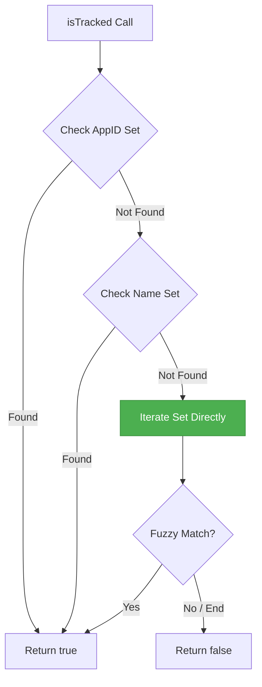

# Optimize State Store Fuzzy Matching Loop

This plan details the optimization of the fuzzy matching loop in `LudusaviStateStore.isTracked` by replacing the `Array.from()` conversion with direct `Set` iteration.

## Problem Definition
In `LudusaviStateStore.isTracked` (located in [ludusaviState.tsx](file:///home/beallio/Dropbox/Scripts/SDH-ludusavi/src/state/ludusaviState.tsx#L206-L213)), the fuzzy matching loop converts `this.snapshot.trackedNames` (a `Set<string>`) to an array using `Array.from()` on every invocation if no exact match is found:
```typescript
for (const trackedName of Array.from(this.snapshot.trackedNames)) {
```
Since this method is called during every game launch and exit event, converting the `Set` to an array of size $N$ results in unnecessary memory allocations, garbage collection pressure, and CPU overhead.

## Architecture Overview
The frontend checks game tracking status during plugin startup and game launch/exit events. By iterating directly over the `Set` using the standard ES6 iterable protocol:
```typescript
for (const trackedName of this.snapshot.trackedNames) {
```
we achieve the same functionality with $O(1)$ memory allocation and eliminate the array conversion overhead.



## Core Data Structures
- `this.snapshot.trackedNames`: `Set<string>` (remains unchanged)

## Public Interfaces
- `LudusaviStateStore.isTracked(name: string, appID: string): boolean` (signature and return type remain unchanged)

## Dependency Requirements
No new dependencies are required. Standard ES6 `Set` iteration is supported natively by the target runtime environment (Decky Loader / Steam client Chromium browser).

## Execution Phases and Tasks

### Phase 1: Test & Infrastructure (Red Stage)
- **Task 1.1: Add failing test for fuzzy matching Set iteration**
  - **Description**: Add `test_frontend_state_store_optimization_no_array_from_in_loop` to `tests/test_frontend_static.py`.
  - **Inputs**: [test_frontend_static.py](file:///home/beallio/Dropbox/Scripts/SDH-ludusavi/tests/test_frontend_static.py)
  - **Outputs**: Modified test suite with static verification of the Set loop.
  - **Validation Criteria**: Run `./run.sh uv run pytest` and verify the test fails (RED status).

### Phase 2: Core Logic Optimization (Green Stage)
- **Task 2.1: Optimize isTracked Set iteration**
  - **Description**: Replace the `Array.from()` call in [ludusaviState.tsx](file:///home/beallio/Dropbox/Scripts/SDH-ludusavi/src/state/ludusaviState.tsx#L206) with direct loop iteration over `this.snapshot.trackedNames`.
  - **Inputs**: [ludusaviState.tsx](file:///home/beallio/Dropbox/Scripts/SDH-ludusavi/src/state/ludusaviState.tsx)
  - **Outputs**: Optimized state store matching loop.
  - **Validation Criteria**: Run `./run.sh uv run pytest` and verify the test passes (GREEN status).

### Phase 3: Code Quality Gate (Refactor & Validation)
- **Task 3.1: Run full quality verification**
  - **Description**: Run TypeScript type checks and Python linter/formatter tools.
  - **Validation Criteria**:
    - `./run.sh pnpm run typecheck` passes with no errors.
    - `./run.sh uv run ruff check . --fix` and `./run.sh uv run ruff format .` pass.
- **Task 3.2: Record Agent Session Log**
  - **Description**: Create the session summary document under `docs/agent_conversations/`.
  - **Outputs**: `docs/agent_conversations/2026-05-23_optimize_state_store_matching.json`
