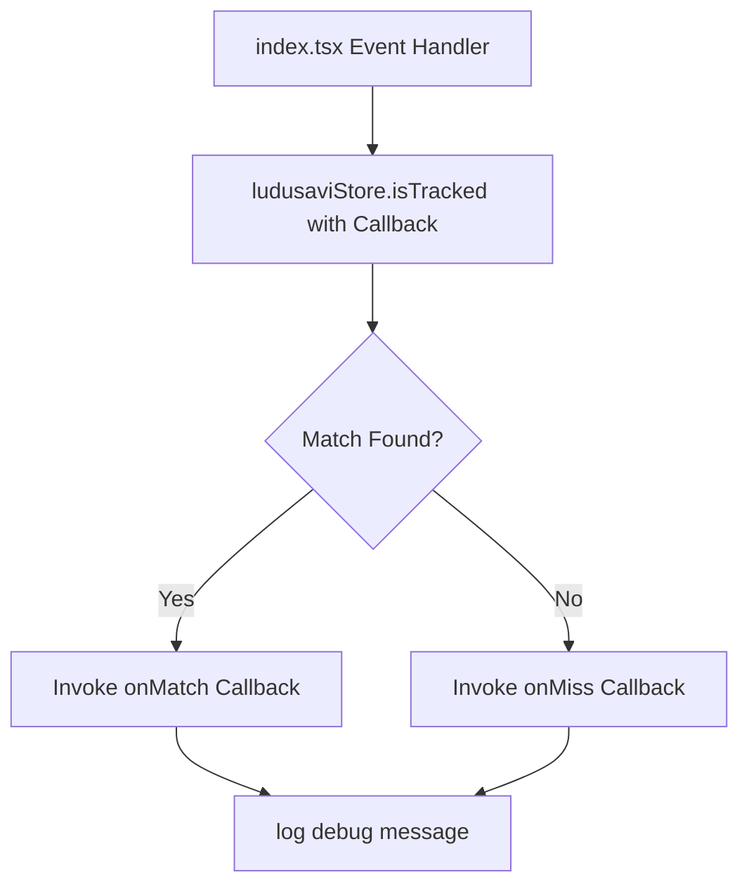

# Unify isTracked Logic and Optimize Fuzzy Matching

This plan details how to resolve the duplicate implementation of `isTracked` in `src/index.tsx`, delegate to `LudusaviStateStore.isTracked`, preserve the debug logging capabilities, and expand our static tests to cover both files.

## Problem Definition
As identified in the review notes [2026-05-23_fuzzy_matching_optimization.md](file:///home/beallio/Dropbox/Scripts/SDH-ludusavi/docs/plans/docs/review/2026-05-23_fuzzy_matching_optimization.md):
1. `isTracked` is duplicated in both `src/index.tsx` and `src/state/ludusaviState.tsx`.
2. The version in `index.tsx` still uses the unoptimized `Array.from()` iteration over the `snapshot.trackedNames` Set.
3. The static test only checks `src/state/ludusaviState.tsx`, missing the duplicate in `src/index.tsx`.
4. The local helper in `index.tsx` includes debug logging which is absent in `ludusaviState.tsx`.

## Architecture Overview
We will unify the logic by having `src/index.tsx` delegate calls to `ludusaviStore.isTracked()`. To keep `LudusaviStateStore` decoupled from the plugin's global `log` utility, we will define optional callbacks (`onMatch` and `onMiss`) in `LudusaviStateStore.isTracked` that the caller in `src/index.tsx` can utilize to output the identical debug logs.



## Core Data Structures
No new data structures are introduced.

## Public Interfaces
Modify `LudusaviStateStore.isTracked` to accept optional log callbacks:
```typescript
isTracked(
  name: string,
  appID: string,
  onMatch?: (reason: "appId" | "exact" | "substring", detail: string) => void,
  onMiss?: (normalizedInput: string) => void
): boolean
```

## Testing Strategy
1. **Red Stage**:
   Update `test_frontend_state_store_optimization_no_array_from_in_loop` in `tests/test_frontend_static.py` to verify that `Array.from` conversions on `trackedNames` are not present in **either** `src/state/ludusaviState.tsx` or `src/index.tsx`.
   Verify the test fails (RED status).
2. **Green Stage**:
   Modify `src/index.tsx` and `src/state/ludusaviState.tsx` to unify the logic.
   Verify tests pass (GREEN status).
3. **Refactor & Validation**:
   Run full checks (`typecheck`, `ruff`, `ty`, `pytest`) to ensure zero regressions.

---

## Execution Phases & Tasks

### Phase 1: Test & Infrastructure (Red Stage)
- **Task 1.1: Update static test to check both files**
  - **Inputs**: [test_frontend_static.py](file:///home/beallio/Dropbox/Scripts/SDH-ludusavi/tests/test_frontend_static.py)
  - **Outputs**: Test checking both `index.tsx` and `ludusaviState.tsx`.
  - **Validation Criteria**: Run `./run.sh uv run pytest` and verify test fails (RED status).

### Phase 2: Core Logic Optimization & Unification (Green Stage)
- **Task 2.1: Implement callback logging support in LudusaviStateStore**
  - **Inputs**: [ludusaviState.tsx](file:///home/beallio/Dropbox/Scripts/SDH-ludusavi/src/state/ludusaviState.tsx)
  - **Outputs**: Upgraded `isTracked` signature and callback hooks.
- **Task 2.2: Refactor index.tsx to delegate to ludusaviStore**
  - **Inputs**: [index.tsx](file:///home/beallio/Dropbox/Scripts/SDH-ludusavi/src/index.tsx)
  - **Outputs**: Removed local duplicate code and added delegate with debug callbacks.
  - **Validation Criteria**: Run `./run.sh uv run pytest` and verify all tests pass (GREEN status).

### Phase 3: Code Quality Gate (Refactor & Validation)
- **Task 3.1: Verification & Typechecks**
  - **Validation Criteria**: Run `./run.sh pnpm run typecheck` and ensure full test suite passes.
- **Task 3.2: Record Agent Session Log**
  - **Outputs**: `docs/agent_conversations/2026-05-24_unify_istracked_logic.json`
