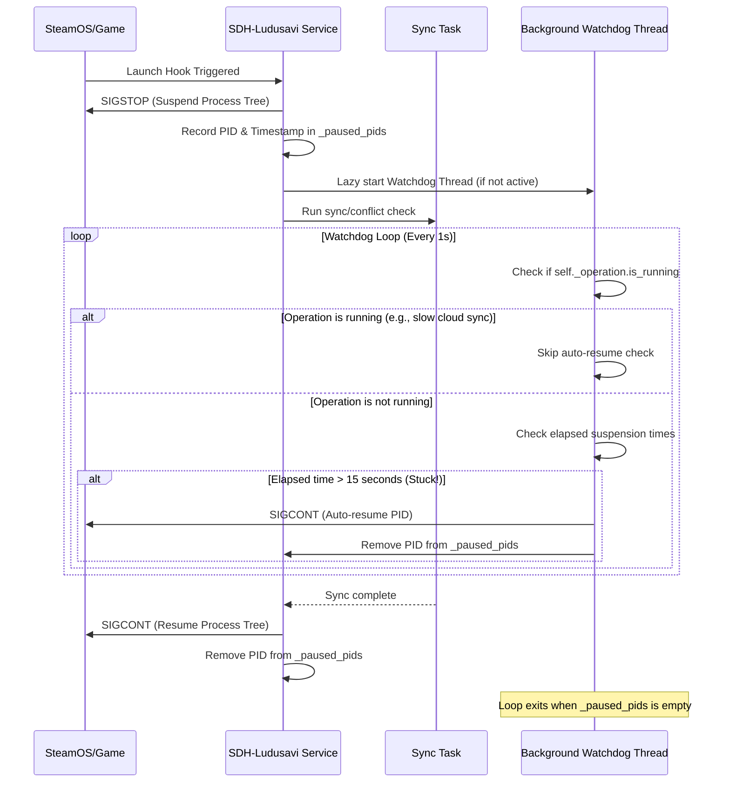
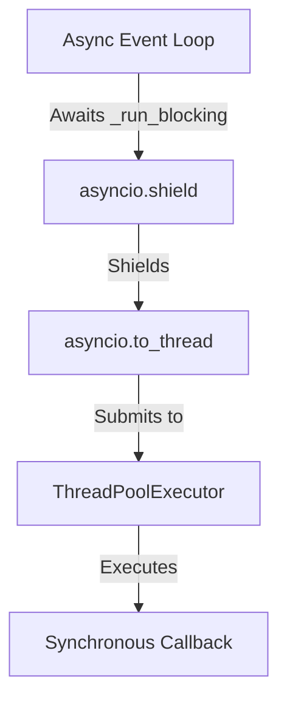

# Plan: Watchdog Safeties for Suspended Processes & Threading Simplification

This document details the design and plan for introducing a background watchdog thread to auto-resume game processes that have been suspended for too long, and for simplifying the asynchronous threading wrapper in `main.py` using `asyncio.to_thread`.

---

## 1. Problem Definition

### A. Watchdog Safeties for Suspended Processes
- **The Issue**: During automatic save sync on game launch, the plugin suspends the game's process tree via `SIGSTOP` (`SDHLudusaviService.pause_game_process`) to prevent save writes while syncing saves or presenting conflict resolution modals to the user. After synchronization completes, it resumes the process tree via `SIGCONT`.
- **The Risk**: If the python process crashes, the plugin unloads abnormally, or an unhandled exception occurs before the resume code path completes, the process tree remains permanently suspended. The game will remain frozen, requiring the user to manually kill it or reboot.
- **The Solution**: Maintain a mapping of paused process IDs to their pause timestamps. Introduce a lazy background watchdog thread that periodically (every 1 second) scans this mapping. If a process has been suspended for longer than a maximum timeout (e.g., 15 seconds), it is automatically resumed and removed from the mapping. The thread should cleanly shut down when no processes are paused.
- **Remote Sync Safeguard**: If a slow remote/cloud backup or restore (e.g., GDrive/rclone) is actively in progress, the active operation state `self._operation.is_running` will be `True`. During this time, the watchdog will bypass auto-resumption to ensure the game is not prematurely resumed, avoiding data corruption.

### B. Synchronous Threading Wrapper Simplification
- **The Issue**: In `main.py`, `_run_blocking` manages thread safety manually using custom `asyncio.Future`, `contextvars` copies, `loop.call_soon_threadsafe`, and spawning raw `threading.Thread` instances for every call.
- **The Solution**: Since Python 3.12 is required, replace this custom boilerplate with `asyncio.to_thread`, which leverages standard library thread pools, handles context propagation, and integrates cleanly with `asyncio`.

---

## 2. Architecture Overview

### Process Suspension & Watchdog Lifecycle

### Simplified Async-to-Sync Execution

---

## 3. Core Data Structures

### Service-level Properties (in `SDHLudusaviService`):
- `self._paused_pids: dict[int, float]`: Map of paused process IDs to the timestamp (`time.time()`) when they were suspended.
- `self._paused_pids_lock: threading.Lock`: Lock protecting access to `self._paused_pids` and the watchdog state.
- `self._watchdog_active: bool`: Indicates whether the background watchdog thread is currently running.
- `self._watchdog_thread: threading.Thread | None`: Reference to the active watchdog thread.
- `self._watchdog_stop: threading.Event`: Event used to trigger early shutdown of the watchdog thread.

---

## 4. Public Interfaces

### Backend Service API (`SDHLudusaviService`):
- `pause_game_process(self, pid: int) -> dict[str, object]`:
  - Registers the process with the current time in `self._paused_pids` and calls `_ensure_watchdog_running()`.
- `resume_game_process(self, pid: int) -> dict[str, object]`:
  - Discards the process from `self._paused_pids`.
- `resume_all_paused_processes(self) -> None`:
  - Clears all keys in `self._paused_pids` and resumes them.
- `stop(self) -> None`:
  - Signals the watchdog thread to terminate and resumes any remaining paused processes.

### Async Entrypoint API (`main.py`):
- `_unload(self) -> None`:
  - Calls `self._backend.stop()` instead of just `resume_all_paused_processes()`.
- `_run_blocking(callback: Any) -> Any`:
  - Awaits `asyncio.shield(asyncio.to_thread(callback))`.

---

## 5. Dependency Requirements
- Uses Python 3.12 standard library components only (`asyncio`, `threading`, `time`, `signal`). No third-party modules required.

---

## 6. Testing Strategy

### Automated Tests
1. **Watchdog Auto-resumption**:
   - Write a unit test that mocks `_send_signal_tree`.
   - Call `pause_game_process` to suspend a PID.
   - Advance/mock the timestamp or wait for 15 seconds.
   - Assert that the PID is automatically resumed by the watchdog thread and removed from the active paused dictionary.
2. **Watchdog Lazy-startup and Exit**:
   - Verify that the watchdog thread is not running initially.
   - Verify it starts upon process suspension.
   - Verify it exits when the paused list becomes empty.
3. **Threading Wrapper Regression Suite**:
   - Run `tests/test_issue_7_cancellation.py` and `tests/test_future_exception_cleanup.py`.
   - Update tests that assert internal details of `_run_blocking` (such as `create_future` and custom Future exception cleanup) to match the simplified `asyncio.to_thread` implementation.
